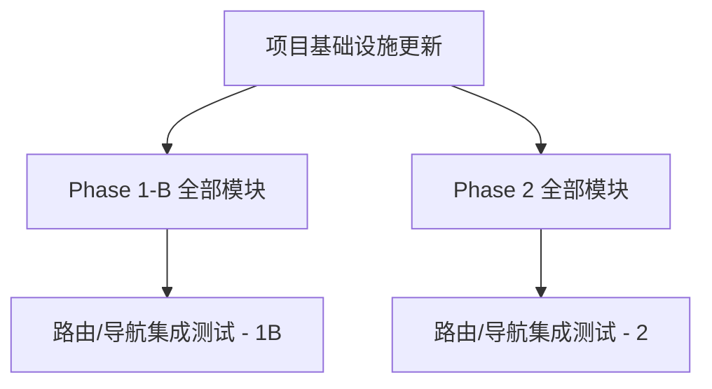

# 极享AI 内部管理系统 — 增量设计：Phase 1-B + Phase 2

> **架构师**：Bob | **日期**：2025-07-15  
> **说明**：本文档在 Phase 1-A 已完成的 56 个源文件基础上，增量设计剩余 8 个模块。不重复已有内容，仅描述新增部分。

---

## 目录

1. [总体架构与模块分组](#1-总体架构与模块分组)
2. [新增类型定义](#2-新增类型定义)
3. [新增 Mock 数据](#3-新增-mock-数据)
4. [增量文件列表](#4-增量文件列表)
5. [路由设计](#5-路由设计)
6. [依赖关系与并行策略](#6-依赖关系与并行策略)
7. [导航菜单更新](#7-导航菜单更新)
8. [共享知识补充](#8-共享知识补充)
9. [任务分解](#9-任务分解)

---

## 1. 总体架构与模块分组

### 1.1 Phase 分组

| Phase | 模块 | 路径前缀 | 子页面数 | 性质 |
|-------|------|---------|---------|------|
| **1B** | 招商代理中心 | `/agent` | 5 | 外部合作管理 |
| **1B** | 获客引流中心 | `/acquisition` | 5 | 流量与获客 |
| **1B** | 案例见证中心 | `/cases` | 4 | 内容沉淀 |
| **1B** | 培训赋能中心 | `/training` | 4 | 内部培训 |
| **2** | 交付服务中心 | `/delivery` | 4 | 服务交付 |
| **2** | 政策合同中心 | `/policies` | 5 | 制度与合同 |
| **2** | 品牌资产中心 | `/brand` | 3 | 品牌管理 |
| **2** | 数据运营中心 | `/data` | 5 | 数据分析 |

### 1.2 设计系统对齐

全部增量模块严格遵循 Phase 1-A 的设计约定：

- **颜色**：使用 `@/theme/tokens` 中定义的 `colors` 对象
- **共享组件**：`SectionHeader` / `ContentCard` / `StatsCard` / `SearchInput` / `FilterChips` / `StatusBadge` / `TierTag`
- **布局**：每个模块一个 Layout 组件（`index.tsx`），使用 `<Outlet />`
- **路由**：嵌套路由，放在 `AppLayout` 的 `children` 中
- **Mock 数据**：统一由 `useMockData.ts` 管理
- **文件命名**：`{Module}Page.tsx` / `{Feature}Page.tsx`
- **组件粒度**：每个文件不超过 400 行，复杂页面拆分为 `components/` 子目录

---

## 2. 新增类型定义

以下内容**增量追加**到 `src/types/index.ts` 文件末尾（在现有类型之后）。

### 2.1 招商代理中心

```typescript
// ============= 招商代理中心 =============

export enum AgentLevel {
  BRONZE = 'bronze',
  SILVER = 'silver',
  GOLD = 'gold',
  PLATINUM = 'platinum',
  DIAMOND = 'diamond',
}

export enum SettlementStatus {
  PENDING = 'pending',
  AUDITING = 'auditing',
  APPROVED = 'approved',
  PAID = 'paid',
  REJECTED = 'rejected',
}

export enum AgreementStatus {
  DRAFT = 'draft',
  PENDING_SIGN = 'pending_sign',
  ACTIVE = 'active',
  EXPIRED = 'expired',
  TERMINATED = 'terminated',
}

export interface Agent {
  id: string;
  name: string;
  phone: string;
  email: string;
  level: AgentLevel;
  region: string;
  totalSales: number;
  totalCommission: number;
  agreementCount: number;
  status: ContentStatus;
  joinedAt: string;
  updatedAt: string;
}

export interface CommissionRule {
  id: string;
  level: AgentLevel;
  productTier: ProductTier;
  commissionRate: number; // 百分比，如 15 表示 15%
  condition: string; // 条件说明
  status: ContentStatus;
  createdAt: string;
}

export interface CommissionSettlement {
  id: string;
  agentId: string;
  agentName: string;
  period: string; // 结算周期，如 "2025-06"
  totalAmount: number;
  commissionAmount: number;
  rate: number;
  status: SettlementStatus;
  orderCount: number;
  paidAt?: string;
  remark?: string;
  createdAt: string;
}

export interface AgentAgreement {
  id: string;
  agentId: string;
  agentName: string;
  title: string;
  level: AgentLevel;
  startDate: string;
  endDate: string;
  commissionRate: number;
  status: AgreementStatus;
  fileUrl?: string;
  remark?: string;
  createdAt: string;
  updatedAt: string;
}

export interface AgentPolicy {
  id: string;
  title: string;
  category: string; // 'level' | 'commission' | 'training' | 'reward'
  content: string;
  effectiveDate: string;
  expireDate?: string;
  status: ContentStatus;
  sortOrder: number;
  createdAt: string;
}

export interface GrowthPath {
  id: string;
  title: string;
  fromLevel: AgentLevel;
  toLevel: AgentLevel;
  requirements: string[];
  benefits: string[];
  estimatedDuration: string;
  sortOrder: number;
  status: ContentStatus;
}
```

### 2.2 获客引流中心

```typescript
// ============= 获客引流中心 =============

export enum AcquisitionChannel {
  SHORT_VIDEO = 'short_video',
  LIVE = 'live',
  PRIVATE_DOMAIN = 'private_domain',
  OFFLINE = 'offline',
}

export enum TaskStatus {
  NOT_STARTED = 'not_started',
  IN_PROGRESS = 'in_progress',
  COMPLETED = 'completed',
  OVERDUE = 'overdue',
}

export interface DailyAction {
  id: string;
  title: string;
  channel: AcquisitionChannel;
  description: string;
  status: TaskStatus;
  assignee: string;
  deadline: string;
  completedAt?: string;
  result?: string;
  createdAt: string;
}

export interface ShortVideoPlan {
  id: string;
  title: string;
  platform: string; // 'douyin' | 'kuaishou' | 'shipinhao'
  script: string;
  publishDate: string;
  status: ContentStatus;
  views: number;
  likes: number;
  comments: number;
  shares: number;
  leads: number; // 引流线索数
  createdAt: string;
}

export interface LiveStreamPlan {
  id: string;
  title: string;
  platform: string;
  scheduledAt: string;
  duration: number; // 分钟
  host: string;
  status: ContentStatus;
  peakViewers: number;
  totalViewers: number;
  newFollowers: number;
  leads: number;
  remark?: string;
  createdAt: string;
}

export interface PrivateDomainRecord {
  id: string;
  channel: string; // 'wechat' | 'group' | 'moments' | 'official_account'
  title: string;
  content: string;
  publishDate: string;
  status: ContentStatus;
  views: number;
  interactions: number;
  leads: number;
  tags: string[];
  createdAt: string;
}

export interface OfflineActivity {
  id: string;
  title: string;
  location: string;
  activityDate: string;
  budget: number;
  actualCost: number;
  contacts: number;
  leads: number;
  status: ContentStatus;
  description: string;
  responsiblePerson: string;
  remark?: string;
  createdAt: string;
}
```

### 2.3 案例见证中心

```typescript
// ============= 案例见证中心 =============

export enum CaseCategory {
  INDUSTRY = 'industry',       // 行业案例
  PRODUCT = 'product',         // 产品案例
  REGION = 'region',           // 区域案例
  TRANSFORMATION = 'transformation', // 转型案例
}

export interface CaseStudy {
  id: string;
  title: string;
  category: CaseCategory;
  customerName: string;
  customerTier: ProductTier;
  coverImage?: string;
  summary: string;
  challenge: string;
  solution: string;
  result: string;
  metrics: { label: string; value: string }[];
  tags: string[];
  status: ContentStatus;
  publishedAt: string;
  createdAt: string;
  updatedAt: string;
}

export interface CaseTemplate {
  id: string;
  title: string;
  description: string;
  category: CaseCategory;
  sections: CaseTemplateSection[];
  status: ContentStatus;
  createdAt: string;
}

export interface CaseTemplateSection {
  id: string;
  title: string;
  placeholder: string;
  hint: string;
  sortOrder: number;
}

export interface MaterialCollection {
  id: string;
  caseId?: string;
  title: string;
  type: 'image' | 'video' | 'document' | 'audio' | 'screenshot';
  fileUrl: string;
  fileSize: number;
  source: string; // 来源描述
  tags: string[];
  status: ContentStatus;
  uploadedAt: string;
  remark?: string;
}

export interface CustomerInterview {
  id: string;
  customerName: string;
  customerTitle: string;
  tier: ProductTier;
  interviewDate: string;
  interviewer: string;
  highlights: string[];
  transcript?: string;
  videoUrl?: string;
  status: ContentStatus;
  tags: string[];
  createdAt: string;
}
```

### 2.4 培训赋能中心

```typescript
// ============= 培训赋能中心 =============

export enum TrainingType {
  VIDEO = 'video',
  LIVE = 'live',
  DOCUMENT = 'document',
  QUIZ = 'quiz',
}

export enum TrainingStatus {
  NOT_STARTED = 'not_started',
  IN_PROGRESS = 'in_progress',
  COMPLETED = 'completed',
  EXPIRED = 'expired',
}

export interface Course {
  id: string;
  title: string;
  type: TrainingType;
  category: string;
  description: string;
  duration: number; // 分钟
  chapters: CourseChapter[];
  instructor: string;
  status: ContentStatus;
  enrolledCount: number;
  completionRate: number;
  rating: number;
  coverImage?: string;
  createdAt: string;
  updatedAt: string;
}

export interface CourseChapter {
  id: string;
  title: string;
  duration: number;
  sortOrder: number;
  isPreview: boolean;
}

export interface TrainingCamp {
  id: string;
  title: string;
  description: string;
  startDate: string;
  endDate: string;
  courses: string[]; // course ids
  maxStudents: number;
  enrolledCount: number;
  status: TrainingStatus;
  instructor: string;
  requirements: string[];
  createdAt: string;
}

export interface StudentAssignment {
  id: string;
  campId: string;
  campTitle: string;
  studentName: string;
  courseId: string;
  courseTitle: string;
  title: string;
  content: string;
  fileUrl?: string;
  score?: number;
  comment?: string;
  submittedAt: string;
  gradedAt?: string;
  status: ContentStatus;
}

export interface StudentProgress {
  id: string;
  studentName: string;
  campId: string;
  campTitle: string;
  courseId: string;
  courseTitle: string;
  progress: number; // 0-100
  status: TrainingStatus;
  lastAccessAt: string;
  enrolledAt: string;
  completedAt?: string;
}
```

### 2.5 交付服务中心

```typescript
// ============= 交付服务中心 =============

export enum SOPCategory {
  ONBOARDING = 'onboarding',       // 客户 onboarding
  DIAGNOSIS = 'diagnosis',         // 诊断服务
  TRAINING = 'training',           // 培训交付
  AFTER_SALE = 'after_sale',       // 售后服务
}

export interface DeliverySOP {
  id: string;
  title: string;
  category: SOPCategory;
  description: string;
  steps: DeliverySOPStep[];
  responsibleRole: string;
  estimatedDays: number;
  status: ContentStatus;
  version: string;
  createdAt: string;
  updatedAt: string;
}

export interface DeliverySOPStep {
  stepOrder: number;
  title: string;
  description: string;
  responsibleRole: string;
  duration: string;
  deliverables: string[];
  checkItems: string[];
}

export interface AcceptanceCriteria {
  id: string;
  title: string;
  category: SOPCategory;
  items: AcceptanceItem[];
  status: ContentStatus;
  createdAt: string;
}

export interface AcceptanceItem {
  id: string;
  label: string;
  description: string;
  standard: string;
  required: boolean;
  method: string; // 验收方式
}

export interface ServiceDiagnosis {
  id: string;
  customerName: string;
  customerTier: ProductTier;
  issueCategory: string;
  description: string;
  severity: Priority;
  diagnosis: string;
  solution: string;
  status: OrderStatus;
  servicePerson: string;
  createdAt: string;
  resolvedAt?: string;
}

export interface AfterSaleRecord {
  id: string;
  customerName: string;
  customerTier: ProductTier;
  type: string; // 'complaint' | 'maintenance' | 'renewal' | 'consultation'
  title: string;
  description: string;
  priority: Priority;
  status: OrderStatus;
  assignee: string;
  responseAt?: string;
  resolvedAt?: string;
  satisfaction?: number; // 1-5
  createdAt: string;
}
```

### 2.6 政策合同中心

```typescript
// ============= 政策合同中心 =============

export enum PolicyStatus {
  DRAFT = 'draft',
  EFFECTIVE = 'effective',
  EXPIRED = 'expired',
  ARCHIVED = 'archived',
}

export interface PricingStrategy {
  id: string;
  name: string;
  productTier: ProductTier;
  basePrice: number;
  discountRules: DiscountRule[];
  effectiveStart: string;
  effectiveEnd?: string;
  status: PolicyStatus;
  remark?: string;
  createdAt: string;
  updatedAt: string;
}

export interface DiscountRule {
  id: string;
  name: string;
  type: 'percentage' | 'fixed' | 'seasonal' | 'volume';
  value: number;
  condition: string;
  priority: number;
}

export interface CommissionPolicy {
  id: string;
  title: string;
  applicableLevels: AgentLevel[];
  commissionRates: { productTier: ProductTier; rate: number }[];
  settlementCycle: string; // 'monthly' | 'quarterly' | 'weekly'
  conditions: string[];
  effectiveDate: string;
  expireDate?: string;
  status: PolicyStatus;
  createdAt: string;
}

export interface RefundPolicy {
  id: string;
  title: string;
  productTier: ProductTier;
  refundPeriod: string; // 退款期限描述
  refundRule: string;
  deductionRule: string;
  exceptions: string[];
  status: PolicyStatus;
  effectiveDate: string;
  createdAt: string;
}

export interface ComplianceRecord {
  id: string;
  title: string;
  category: string; // 'contract' | 'data_privacy' | 'advertising' | 'tax'
  description: string;
  requirement: string;
  deadline: string;
  responsiblePerson: string;
  status: ContentStatus;
  remark?: string;
  createdAt: string;
}

export interface ContractTemplate {
  id: string;
  title: string;
  category: string; // 'agency' | 'oem' | 'partner' | 'service'
  version: string;
  clauses: ContractClause[];
  status: ContentStatus;
  fileUrl?: string;
  createdAt: string;
  updatedAt: string;
}

export interface ContractClause {
  id: string;
  title: string;
  content: string;
  sortOrder: number;
  isRequired: boolean;
}
```

### 2.7 品牌资产中心

```typescript
// ============= 品牌资产中心 =============

export interface VISpec {
  id: string;
  title: string;
  category: string; // 'logo' | 'color' | 'typography' | 'icon' | 'imagery'
  description: string;
  rules: string[];
  examples: { name: string; url: string }[];
  status: ContentStatus;
  version: string;
  updatedAt: string;
}

export interface BrandTemplate {
  id: string;
  title: string;
  category: string; // 'social_media' | 'presentation' | 'document' | 'email' | 'ad'
  thumbnail?: string;
  description: string;
  fileUrl: string;
  fileFormat: string;
  fileSize: number;
  usage: string;
  tags: string[];
  status: ContentStatus;
  createdAt: string;
}

export interface BrandCertificate {
  id: string;
  title: string;
  type: string; // 'trademark' | 'copyright' | 'license' | 'certification' | 'patent'
  certNumber: string;
  issuer: string;
  issueDate: string;
  expireDate?: string;
  fileUrl?: string;
  status: ContentStatus;
  remark?: string;
  createdAt: string;
}
```

### 2.8 数据运营中心

```typescript
// ============= 数据运营中心 =============

export enum DataMetricType {
  REVENUE = 'revenue',
  USER = 'user',
  CONVERSION = 'conversion',
  CONTENT = 'content',
  SERVICE = 'service',
}

export interface OperationDashboard {
  id: string;
  title: string;
  period: string;
  kpis: KPIItem[];
  charts: ChartData[];
  createdAt: string;
}

export interface ChartData {
  id: string;
  title: string;
  type: 'line' | 'bar' | 'pie' | 'funnel';
  labels: string[];
  datasets: { name: string; values: number[]; color: string }[];
}

export interface DataFunnel {
  id: string;
  name: string;
  stages: FunnelStage[];
  period: string;
  updatedAt: string;
}

export interface FunnelStage {
  stage: string;
  count: number;
  rate: string;
  color: string;
}

export interface RankingItem {
  id: string;
  rank: number;
  name: string;
  metric: number;
  metricLabel: string;
  change: number;
  trend: 'up' | 'down' | 'flat';
}

export interface ComplaintAnalysis {
  id: string;
  category: string;
  count: number;
  proportion: number;
  trend: 'up' | 'down' | 'flat';
  topIssues: { issue: string; count: number }[];
}

export interface OperationReview {
  id: string;
  title: string;
  period: string;
  author: string;
  summary: string;
  highlights: string[];
  issues: string[];
  actionItems: { action: string; owner: string; deadline: string }[];
  status: ContentStatus;
  createdAt: string;
}
```

---

## 3. 新增 Mock 数据

以下内容**增量追加**到 `src/hooks/useMockData.ts` 文件末尾。

### 3.1 招商代理中心 Mock

```typescript
/* ============= 招商代理中心 ============= */

export function useAgentList(): Agent[] {
  return useMemo(() => [
    {
      id: 'AGT-001', name: '张伟', phone: '138****1234', email: 'zhangwei@example.com',
      level: AgentLevel.GOLD, region: '华东-上海', totalSales: 458000, totalCommission: 68700,
      agreementCount: 2, status: ContentStatus.PUBLISHED, joinedAt: '2024-03-15', updatedAt: '2024-12-18',
    },
    {
      id: 'AGT-002', name: '李芳', phone: '139****5678', email: 'lifang@example.com',
      level: AgentLevel.PLATINUM, region: '华南-广州', totalSales: 892000, totalCommission: 133800,
      agreementCount: 3, status: ContentStatus.PUBLISHED, joinedAt: '2024-01-10', updatedAt: '2024-12-17',
    },
    {
      id: 'AGT-003', name: '王强', phone: '137****9012', email: 'wangqiang@example.com',
      level: AgentLevel.SILVER, region: '华北-北京', totalSales: 215000, totalCommission: 32250,
      agreementCount: 1, status: ContentStatus.PUBLISHED, joinedAt: '2024-06-01', updatedAt: '2024-12-15',
    },
    {
      id: 'AGT-004', name: '赵敏', phone: '136****3456', email: 'zhaomin@example.com',
      level: AgentLevel.DIAMOND, region: '西南-成都', totalSales: 1560000, totalCommission: 234000,
      agreementCount: 4, status: ContentStatus.PUBLISHED, joinedAt: '2023-09-20', updatedAt: '2024-12-18',
    },
    {
      id: 'AGT-005', name: '陈刚', phone: '158****7890', email: 'chengang@example.com',
      level: AgentLevel.BRONZE, region: '华中-武汉', totalSales: 89000, totalCommission: 13350,
      agreementCount: 1, status: ContentStatus.PUBLISHED, joinedAt: '2024-09-01', updatedAt: '2024-12-10',
    },
    {
      id: 'AGT-006', name: '刘洋', phone: '186****2345', email: 'liuyang@example.com',
      level: AgentLevel.GOLD, region: '华东-杭州', totalSales: 567000, totalCommission: 85050,
      agreementCount: 2, status: ContentStatus.PUBLISHED, joinedAt: '2024-04-10', updatedAt: '2024-12-16',
    },
  ], []);
}

export function useCommissionRules(): CommissionRule[] {
  return useMemo(() => [
    { id: 'CR-001', level: AgentLevel.BRONZE, productTier: ProductTier.STANDARD, commissionRate: 10, condition: '月销售额≥5万', status: ContentStatus.PUBLISHED, createdAt: '2024-01-01' },
    { id: 'CR-002', level: AgentLevel.SILVER, productTier: ProductTier.STANDARD, commissionRate: 12, condition: '月销售额≥10万', status: ContentStatus.PUBLISHED, createdAt: '2024-01-01' },
    { id: 'CR-003', level: AgentLevel.SILVER, productTier: ProductTier.AGENT, commissionRate: 15, condition: '月销售额≥10万', status: ContentStatus.PUBLISHED, createdAt: '2024-01-01' },
    { id: 'CR-004', level: AgentLevel.GOLD, productTier: ProductTier.AGENT, commissionRate: 18, condition: '月销售额≥20万', status: ContentStatus.PUBLISHED, createdAt: '2024-01-01' },
    { id: 'CR-005', level: AgentLevel.GOLD, productTier: ProductTier.OEM, commissionRate: 20, condition: '月销售额≥20万', status: ContentStatus.PUBLISHED, createdAt: '2024-01-01' },
    { id: 'CR-006', level: AgentLevel.PLATINUM, productTier: ProductTier.OEM, commissionRate: 22, condition: '月销售额≥50万', status: ContentStatus.PUBLISHED, createdAt: '2024-01-01' },
    { id: 'CR-007', level: AgentLevel.PLATINUM, productTier: ProductTier.PARTNER, commissionRate: 25, condition: '月销售额≥50万', status: ContentStatus.PUBLISHED, createdAt: '2024-01-01' },
    { id: 'CR-008', level: AgentLevel.DIAMOND, productTier: ProductTier.PARTNER, commissionRate: 30, condition: '月销售额≥100万', status: ContentStatus.PUBLISHED, createdAt: '2024-01-01' },
  ], []);
}

export function useSettlements(): CommissionSettlement[] {
  return useMemo(() => [
    { id: 'SET-001', agentId: 'AGT-001', agentName: '张伟', period: '2024-11', totalAmount: 48500, commissionAmount: 7275, rate: 15, status: SettlementStatus.APPROVED, orderCount: 12, paidAt: '2024-12-10', createdAt: '2024-12-01' },
    { id: 'SET-002', agentId: 'AGT-002', agentName: '李芳', period: '2024-11', totalAmount: 89600, commissionAmount: 16128, rate: 18, status: SettlementStatus.PAID, orderCount: 23, paidAt: '2024-12-12', createdAt: '2024-12-01' },
    { id: 'SET-003', agentId: 'AGT-004', agentName: '赵敏', period: '2024-11', totalAmount: 156800, commissionAmount: 34496, rate: 22, status: SettlementStatus.PAID, orderCount: 35, paidAt: '2024-12-12', createdAt: '2024-12-01' },
    { id: 'SET-004', agentId: 'AGT-003', agentName: '王强', period: '2024-11', totalAmount: 23500, commissionAmount: 2820, rate: 12, status: SettlementStatus.AUDITING, orderCount: 5, createdAt: '2024-12-01' },
    { id: 'SET-005', agentId: 'AGT-001', agentName: '张伟', period: '2024-10', totalAmount: 52000, commissionAmount: 7800, rate: 15, status: SettlementStatus.PAID, orderCount: 14, paidAt: '2024-11-10', createdAt: '2024-11-01' },
    { id: 'SET-006', agentId: 'AGT-006', agentName: '刘洋', period: '2024-11', totalAmount: 62300, commissionAmount: 9345, rate: 15, status: SettlementStatus.PENDING, orderCount: 8, createdAt: '2024-12-01' },
    { id: 'SET-007', agentId: 'AGT-005', agentName: '陈刚', period: '2024-11', totalAmount: 9800, commissionAmount: 980, rate: 10, status: SettlementStatus.REJECTED, remark: '订单数据有误，需核实', orderCount: 3, createdAt: '2024-12-01' },
  ], []);
}

export function useAgentAgreements(): AgentAgreement[] {
  return useMemo(() => [
    { id: 'AGR-001', agentId: 'AGT-001', agentName: '张伟', title: '黄金代理合作协议（2024）', level: AgentLevel.GOLD, startDate: '2024-03-15', endDate: '2025-03-14', commissionRate: 15, status: AgreementStatus.ACTIVE, createdAt: '2024-03-15', updatedAt: '2024-11-20' },
    { id: 'AGR-002', agentId: 'AGT-002', agentName: '李芳', title: '铂金代理合作协议（2024-2025）', level: AgentLevel.PLATINUM, startDate: '2024-01-10', endDate: '2025-07-09', commissionRate: 22, status: AgreementStatus.ACTIVE, createdAt: '2024-01-10', updatedAt: '2024-12-01' },
    { id: 'AGR-003', agentId: 'AGT-004', agentName: '赵敏', title: '钻石代理合作协议（2024-2026）', level: AgentLevel.DIAMOND, startDate: '2024-03-01', endDate: '2026-02-28', commissionRate: 30, status: AgreementStatus.ACTIVE, createdAt: '2024-03-01', updatedAt: '2024-12-10' },
    { id: 'AGR-004', agentId: 'AGT-003', agentName: '王强', title: '白银代理合作协议（2024）', level: AgentLevel.SILVER, startDate: '2024-06-01', endDate: '2024-11-30', commissionRate: 12, status: AgreementStatus.EXPIRED, createdAt: '2024-06-01', updatedAt: '2024-11-30' },
    { id: 'AGR-005', agentId: 'AGT-005', agentName: '陈刚', title: '青铜代理合作协议', level: AgentLevel.BRONZE, startDate: '2024-09-01', endDate: '2025-08-31', commissionRate: 10, status: AgreementStatus.PENDING_SIGN, createdAt: '2024-09-01', updatedAt: '2024-09-01' },
  ], []);
}

export function useAgentPolicies(): AgentPolicy[] {
  return useMemo(() => [
    { id: 'AP-001', title: '代理商等级晋升标准（2024版）', category: 'level', content: '代理商等级分为青铜、白银、黄金、铂金、钻石五级。晋升条件包括销售额门槛、合作时长、客户满意度等维度。', effectiveDate: '2024-01-01', status: ContentStatus.PUBLISHED, sortOrder: 1, createdAt: '2024-01-01' },
    { id: 'AP-002', title: '月度佣金结算规则', category: 'commission', content: '每月5日前生成上月结算单，15日前完成打款。佣金根据代理等级和产品线阶梯式比例计算。', effectiveDate: '2024-01-01', status: ContentStatus.PUBLISHED, sortOrder: 2, createdAt: '2024-01-01' },
    { id: 'AP-003', title: '新代理商启航培训计划', category: 'training', content: '新签约代理商需在30天内完成基础培训，含产品知识、系统操作、销售技巧三大模块。', effectiveDate: '2024-03-01', status: ContentStatus.PUBLISHED, sortOrder: 3, createdAt: '2024-03-01' },
    { id: 'AP-004', title: '季度销售竞赛奖励办法', category: 'reward', content: '每季度根据销售额排名，前三名分别获得额外奖励金和晋升推荐。', effectiveDate: '2024-06-01', status: ContentStatus.PUBLISHED, sortOrder: 4, createdAt: '2024-06-01' },
    { id: 'AP-005', title: '代理商考核退出机制', category: 'level', content: '连续3个月未达标或严重违规的代理商，将启动降级或退出流程。', effectiveDate: '2024-01-01', expireDate: '2025-01-01', status: ContentStatus.DRAFT, sortOrder: 5, createdAt: '2024-12-01' },
  ], []);
}

export function useGrowthPaths(): GrowthPath[] {
  return useMemo(() => [
    { id: 'GP-001', title: '青铜→白银成长路径', fromLevel: AgentLevel.BRONZE, toLevel: AgentLevel.SILVER, requirements: ['月均销售额≥10万', '合作满3个月', '完成基础培训', '客户满意度≥4星'], benefits: ['佣金比例提升2%', '享优先技术支持', '月度数据报告'], estimatedDuration: '3-6个月', sortOrder: 1, status: ContentStatus.PUBLISHED },
    { id: 'GP-002', title: '白银→黄金成长路径', fromLevel: AgentLevel.SILVER, toLevel: AgentLevel.GOLD, requirements: ['月均销售额≥20万', '合作满6个月', '通过进阶考核', '无违规记录'], benefits: ['佣金比例提升3%', '专属客户经理', '季度市场活动支持', '品牌授权使用'], estimatedDuration: '6-12个月', sortOrder: 2, status: ContentStatus.PUBLISHED },
    { id: 'GP-003', title: '黄金→铂金成长路径', fromLevel: AgentLevel.GOLD, toLevel: AgentLevel.PLATINUM, requirements: ['月均销售额≥50万', '合作满12个月', '团队≥5人', '培养2名新代理'], benefits: ['佣金比例提升4%', '区域保护政策', '联合品牌推广', '年度海外考察名额'], estimatedDuration: '12-18个月', sortOrder: 3, status: ContentStatus.PUBLISHED },
    { id: 'GP-004', title: '铂金→钻石成长路径', fromLevel: AgentLevel.PLATINUM, toLevel: AgentLevel.DIAMOND, requirements: ['月均销售额≥100万', '合作满24个月', '团队≥15人', '区域市场占有率≥30%'], benefits: ['佣金比例提升5%', '区域独家授权', '公司分红权益', '战略合伙人身份', '董事会列席资格'], estimatedDuration: '18-36个月', sortOrder: 4, status: ContentStatus.PUBLISHED },
  ], []);
}
```

### 3.2 获客引流中心 Mock

```typescript
/* ============= 获客引流中心 ============= */

export function useDailyActions(): DailyAction[] {
  return useMemo(() => [
    { id: 'DA-001', title: '发布抖音短视频（产品功能介绍）', channel: AcquisitionChannel.SHORT_VIDEO, description: '制作并发布一条60秒内的产品功能介绍短视频', status: TaskStatus.COMPLETED, assignee: '李明', deadline: '2024-12-18', completedAt: '2024-12-18', result: '播放量8500，点赞320，新增线索15条', createdAt: '2024-12-17' },
    { id: 'DA-002', title: '微信群日常运营（3个群）', channel: AcquisitionChannel.PRIVATE_DOMAIN, description: '在3个客户微信群中分享行业资讯和产品干货', status: TaskStatus.IN_PROGRESS, assignee: '王芳', deadline: '2024-12-19', createdAt: '2024-12-18' },
    { id: 'DA-003', title: '朋友圈推广文案发布', channel: AcquisitionChannel.PRIVATE_DOMAIN, description: '发布一条关于限时优惠的朋友圈文案', status: TaskStatus.NOT_STARTED, assignee: '李明', deadline: '2024-12-20', createdAt: '2024-12-18' },
    { id: 'DA-004', title: '策划周末地推活动方案', channel: AcquisitionChannel.OFFLINE, description: '完成周末商圈地推活动的详细方案策划', status: TaskStatus.IN_PROGRESS, assignee: '陈晨', deadline: '2024-12-21', createdAt: '2024-12-16' },
    { id: 'DA-005', title: '预约直播嘉宾（周三场）', channel: AcquisitionChannel.LIVE, description: '联系并确认周三直播的嘉宾人选和话题', status: TaskStatus.OVERDUE, assignee: '王芳', deadline: '2024-12-17', createdAt: '2024-12-14' },
  ], []);
}

export function useShortVideoPlans(): ShortVideoPlan[] {
  return useMemo(() => [
    { id: 'SV-001', title: '极享AI 1分钟快速上手', platform: 'douyin', script: '展示从注册到生成第一条话术的全流程，突出简单易用', publishDate: '2024-12-15', status: ContentStatus.PUBLISHED, views: 12500, likes: 890, comments: 56, shares: 234, leads: 42, createdAt: '2024-12-10' },
    { id: 'SV-002', title: '直播带货翻倍秘籍（上）', platform: 'douyin', script: '分享3个提升直播间转化的实用技巧，引出极享AI解决方案', publishDate: '2024-12-12', status: ContentStatus.PUBLISHED, views: 23200, likes: 1560, comments: 128, shares: 567, leads: 89, createdAt: '2024-12-08' },
    { id: 'SV-003', title: '客户诊断实操演示', platform: 'kuaishou', script: '现场演示如何使用极享AI的客户诊断工具，从分析到出方案', publishDate: '2024-12-18', status: ContentStatus.PUBLISHED, views: 8900, likes: 620, comments: 45, shares: 178, leads: 28, createdAt: '2024-12-14' },
    { id: 'SV-004', title: '代理商成功故事-李芳专访', platform: 'shipinhao', script: '采访铂金代理李芳，分享从个体到达人团队的成长经历', publishDate: '2024-12-20', status: ContentStatus.DRAFT, views: 0, likes: 0, comments: 0, shares: 0, leads: 0, createdAt: '2024-12-16' },
    { id: 'SV-005', title: '年底收官·限时福利预告', platform: 'douyin', script: '年底回馈老客户，限时折扣+赠品活动预告', publishDate: '2024-12-22', status: ContentStatus.DRAFT, views: 0, likes: 0, comments: 0, shares: 0, leads: 0, createdAt: '2024-12-18' },
  ], []);
}

export function useLiveStreamPlans(): LiveStreamPlan[] {
  return useMemo(() => [
    { id: 'LS-001', title: '极享AI产品深度解读：代理版', platform: '抖音', scheduledAt: '2024-12-19 19:00', duration: 60, host: '张老师', status: ContentStatus.PUBLISHED, peakViewers: 328, totalViewers: 1850, newFollowers: 89, leads: 36, remark: '重点介绍客户诊断功能', createdAt: '2024-12-15' },
    { id: 'LS-002', title: '直播带货实战技巧分享', platform: '视频号', scheduledAt: '2024-12-17 15:00', duration: 45, host: '王芳', status: ContentStatus.PUBLISHED, peakViewers: 256, totalViewers: 1230, newFollowers: 56, leads: 22, createdAt: '2024-12-13' },
    { id: 'LS-003', title: '年终回馈·限时秒杀专场', platform: '抖音', scheduledAt: '2024-12-22 20:00', duration: 90, host: '张老师', status: ContentStatus.DRAFT, peakViewers: 0, totalViewers: 0, newFollowers: 0, leads: 0, createdAt: '2024-12-18' },
    { id: 'LS-004', title: 'AI赋能直播带货：2025趋势展望', platform: '快手', scheduledAt: '2024-12-25 14:00', duration: 60, host: '李总', status: ContentStatus.DRAFT, peakViewers: 0, totalViewers: 0, newFollowers: 0, leads: 0, createdAt: '2024-12-18' },
    { id: 'LS-005', title: '新品发布：OEM贴牌版全新升级', platform: '抖音', scheduledAt: '2024-12-14 20:00', duration: 75, host: '张老师', status: ContentStatus.PUBLISHED, peakViewers: 412, totalViewers: 2680, newFollowers: 134, leads: 58, createdAt: '2024-12-10' },
  ], []);
}

export function usePrivateDomainRecords(): PrivateDomainRecord[] {
  return useMemo(() => [
    { id: 'PD-001', channel: 'wechat', title: '1对1跟进：高意向客户王总', content: '发送产品介绍资料并预约Demo演示', publishDate: '2024-12-18', status: ContentStatus.PUBLISHED, views: 1, interactions: 1, leads: 1, tags: ['高意向', '跟进'], createdAt: '2024-12-18' },
    { id: 'PD-002', channel: 'group', title: '行业交流群：分享AI直播趋势报告', content: '在3个行业交流群分享2025年AI直播带货趋势报告', publishDate: '2024-12-17', status: ContentStatus.PUBLISHED, views: 680, interactions: 45, leads: 8, tags: ['行业报告', '群运营'], createdAt: '2024-12-17' },
    { id: 'PD-003', channel: 'moments', title: '朋友圈：客户成功案例分享', content: '分享某代理商用极享AI后销量翻倍的真实案例', publishDate: '2024-12-16', status: ContentStatus.PUBLISHED, views: 3560, interactions: 128, leads: 15, tags: ['案例', '朋友圈'], createdAt: '2024-12-16' },
    { id: 'PD-004', channel: 'official_account', title: '公众号推文：极享AI年度总结', content: '盘点2024年极享AI的重要更新和客户成功故事', publishDate: '2024-12-20', status: ContentStatus.DRAFT, views: 0, interactions: 0, leads: 0, tags: ['公众号', '年度总结'], createdAt: '2024-12-15' },
    { id: 'PD-005', channel: 'group', title: '老客户福利群：年终回馈活动', content: '在VIP客户群发布年终回馈活动详情，老客户专享折扣', publishDate: '2024-12-19', status: ContentStatus.DRAFT, views: 0, interactions: 0, leads: 0, tags: ['福利', '回馈'], createdAt: '2024-12-18' },
  ], []);
}

export function useOfflineActivities(): OfflineActivity[] {
  return useMemo(() => [
    { id: 'OA-001', title: '上海浦东新国际博览中心展会', location: '上海新国际博览中心E3馆', activityDate: '2024-12-10', budget: 15000, actualCost: 12800, contacts: 256, leads: 68, status: ContentStatus.PUBLISHED, description: '参加2024年AI产业博览会，现场展示产品并收集意向客户', responsiblePerson: '张明', createdAt: '2024-11-20' },
    { id: 'OA-002', title: '广州天河商圈地推活动', location: '广州天河城广场', activityDate: '2024-12-15', budget: 8000, actualCost: 7200, contacts: 180, leads: 42, status: ContentStatus.PUBLISHED, description: '周末商圈地推，面向电商创业者和中小商家推广', responsiblePerson: '李芳', createdAt: '2024-12-01' },
    { id: 'OA-003', title: '杭州互联网创业沙龙', location: '杭州梦想小镇', activityDate: '2024-12-22', budget: 5000, actualCost: 0, contacts: 0, leads: 0, status: ContentStatus.DRAFT, description: '联合杭州本地创业社区举办小型沙龙，分享AI销售工具趋势', responsiblePerson: '陈晨', createdAt: '2024-12-12' },
    { id: 'OA-004', title: '成都代理商招募会', location: '成都高新区希尔顿酒店', activityDate: '2024-12-28', budget: 20000, actualCost: 0, contacts: 0, leads: 0, status: ContentStatus.DRAFT, description: '2025年第一季度西南地区代理商招募说明会', responsiblePerson: '张明', createdAt: '2024-12-15' },
  ], []);
}
```

### 3.3 案例见证中心 Mock

```typescript
/* ============= 案例见证中心 ============= */

export function useCaseStudies(): CaseStudy[] {
  return useMemo(() => [
    {
      id: 'CS-001', title: '从0到月销60万：新手主播小美的蜕变', category: CaseCategory.TRANSFORMATION, customerName: '小美', customerTier: ProductTier.AGENT,
      summary: '零基础直播新手，借助极享AI全套工具，3个月内实现月销60万的突破',
      challenge: '完全没有直播经验，不会写话术，不懂数据分析，试播第一周只有3个观众',
      solution: '使用极享AI标准版→代理版，从AI话术生成开始，逐步使用客户诊断、竞品分析功能，系统化提升销售能力',
      result: '第1个月：月销2.8万 → 第2个月：月销18万 → 第3个月：月销62万，加微率从5%提升到42%',
      metrics: [{ label: '月销售额', value: '62万' }, { label: '加微率', value: '42%' }, { label: '客单价', value: '¥2,850' }, { label: '转化率', value: '28%' }],
      tags: ['新手', '直播', '逆袭'], status: ContentStatus.PUBLISHED, publishedAt: '2024-11-15', createdAt: '2024-11-10', updatedAt: '2024-12-01',
    },
    {
      id: 'CS-002', title: '品牌化升级：广州某MCN机构OEM合作案例', category: CaseCategory.PRODUCT, customerName: '广州星光MCN', customerTier: ProductTier.OEM,
      summary: '中型MCN机构通过OEM贴牌合作，打造自有品牌的AI销售赋能体系',
      challenge: '旗下30+主播，管理混乱，缺乏统一话术和数据体系，品牌化需求迫切',
      solution: '采用OEM贴牌版，定制品牌化的AI话术系统+CRM集成+数据看板，全员培训和考核',
      result: '主播管理效率提升200%，话术产出效率提升500%，整体GMV增长180%',
      metrics: [{ label: 'GMV增长', value: '180%' }, { label: '主播人效', value: '3倍' }, { label: '话术产出', value: '5倍' }, { label: '客户满意度', value: '4.8/5' }],
      tags: ['OEM', 'MCN', '品牌化'], status: ContentStatus.PUBLISHED, publishedAt: '2024-10-20', createdAt: '2024-10-15', updatedAt: '2024-11-25',
    },
    {
      id: 'CS-003', title: '区域独家代理：成都赵敏的合伙人之路', category: CaseCategory.REGION, customerName: '赵敏', customerTier: ProductTier.PARTNER,
      summary: '从个人代理到区域合伙人，1年实现月流水150万+的跨越式增长',
      challenge: '早期作为个人代理，受限于品牌影响力和工具不足，增长遇到瓶颈',
      solution: '升级为合伙人，获得区域独家授权、品牌溢价分润和总部战略资源',
      result: '团队从1人扩展到18人，覆盖西南地区3省，月流水突破150万',
      metrics: [{ label: '月流水', value: '156万' }, { label: '团队规模', value: '18人' }, { label: '客户数', value: '286家' }, { label: '年分红', value: '35万' }],
      tags: ['合伙人', '区域代理', '增长'], status: ContentStatus.PUBLISHED, publishedAt: '2024-12-01', createdAt: '2024-11-28', updatedAt: '2024-12-10',
    },
    {
      id: 'CS-004', title: '传统电商转型AI直播的标杆案例', category: CaseCategory.INDUSTRY, customerName: '杭州品尚电商', customerTier: ProductTier.AGENT,
      summary: '传统电商团队成功转型AI直播带货，3个月实现业绩翻番',
      challenge: '传统图文电商流量下滑，直播转型困难，缺乏直播人才和话术体系',
      solution: '使用极享AI代理版，从话术生成到客户诊断到报价全流程AI赋能',
      result: '成功孵化3个直播账号，月GMV从80万增长到160万，团队人均提成翻倍',
      metrics: [{ label: '月GMV', value: '160万' }, { label: '直播号', value: '3个' }, { label: 'ROI', value: '1:8' }, { label: '团队满意', value: '96%' }],
      tags: ['传统电商', '转型', '直播'], status: ContentStatus.PUBLISHED, publishedAt: '2024-11-25', createdAt: '2024-11-20', updatedAt: '2024-12-05',
    },
    {
      id: 'CS-005', title: '连锁品牌客户诊断提效案例', category: CaseCategory.INDUSTRY, customerName: '贝贝母婴连锁', customerTier: ProductTier.AGENT,
      summary: '全国28家连锁门店使用客户诊断工具后，销售效率提升3倍',
      challenge: '连锁门店销售能力参差不齐，客户流失率高，缺乏标准化的跟进流程',
      solution: '使用极享AI客户诊断+SOP系统，建立标准化的客户跟进和服务流程',
      result: '客户转化率提升65%，平均成交周期从7天缩短到2天，客户满意度提升至4.7',
      metrics: [{ label: '转化率', value: '+65%' }, { label: '成交周期', value: '2天' }, { label: '门店覆盖', value: '28家' }, { label: '满意率', value: '94%' }],
      tags: ['连锁', '诊断', '标准化'], status: ContentStatus.PUBLISHED, publishedAt: '2024-12-05', createdAt: '2024-12-01', updatedAt: '2024-12-12',
    },
    {
      id: 'CS-006', title: '0成本启动：宝妈兼职月入2万+', category: CaseCategory.TRANSFORMATION, customerName: '林晓', customerTier: ProductTier.STANDARD,
      summary: '全职宝妈利用业余时间，通过极享AI标准版实现月入2万+的副业收入',
      challenge: '时间碎片化，没有团队，预算有限，需要低门槛低成本的解决方案',
      solution: '选择标准版，利用AI话术生成和社群运营功能，专注小规模精准转化',
      result: '每天投入2-3小时，月均成交22单，月收入稳定在2万以上',
      metrics: [{ label: '月投入', value: '60小时' }, { label: '月收入', value: '2.2万' }, { label: '成交单数', value: '22单' }, { label: 'ROI', value: '1:24' }],
      tags: ['宝妈', '副业', '轻创业'], status: ContentStatus.DRAFT, publishedAt: '', createdAt: '2024-12-10', updatedAt: '2024-12-15',
    },
  ], []);
}

export function useCaseTemplates(): CaseTemplate[] {
  return useMemo(() => [
    {
      id: 'CT-001', title: '客户转型故事模板', description: '适合客户从使用前到使用后的转变故事', category: CaseCategory.TRANSFORMATION,
      sections: [
        { id: 'CTS-001', title: '客户背景', placeholder: '描述客户的行业、规模、原有痛点...', hint: '重点突出客户转型前的困境', sortOrder: 1 },
        { id: 'CTS-002', title: '面临挑战', placeholder: '客户遇到的具体问题和瓶颈...', hint: '量化问题，如"月销量不足XX"', sortOrder: 2 },
        { id: 'CTS-003', title: '解决方案', placeholder: '如何使用极享AI解决上述问题...', hint: '说明使用了哪些功能模块', sortOrder: 3 },
        { id: 'CTS-004', title: '最终成果', placeholder: '使用后的具体数据提升...', hint: '用数据说话，前后对比', sortOrder: 4 },
      ],
      status: ContentStatus.PUBLISHED, createdAt: '2024-06-01',
    },
    {
      id: 'CT-002', title: '产品案例模板', description: '聚焦某个产品版本或功能的实际应用效果', category: CaseCategory.PRODUCT,
      sections: [
        { id: 'CTS-005', title: '产品概述', placeholder: '介绍使用的产品版本和核心功能...', hint: '说明为什么选择这个版本', sortOrder: 1 },
        { id: 'CTS-006', title: '使用场景', placeholder: '客户在什么场景下使用产品...', hint: '描述具体的使用场景和频率', sortOrder: 2 },
        { id: 'CTS-007', title: '应用效果', placeholder: '使用后的具体收益和变化...', hint: '包含定性+定量效果', sortOrder: 3 },
        { id: 'CTS-008', title: '客户评价', placeholder: '客户的原话评价...', hint: '至少3条真实客户评价', sortOrder: 4 },
      ],
      status: ContentStatus.PUBLISHED, createdAt: '2024-06-15',
    },
  ], []);
}

export function useMaterials(): MaterialCollection[] {
  return useMemo(() => [
    { id: 'MAT-001', caseId: 'CS-001', title: '小美直播截图（前后对比）', type: 'screenshot', fileUrl: '/mock/materials/screenshot_001.png', fileSize: 2.4, source: '客户提供', tags: ['案例素材', '直播'], status: ContentStatus.PUBLISHED, uploadedAt: '2024-11-12' },
    { id: 'MAT-002', caseId: 'CS-001', title: '小美采访视频（3分钟）', type: 'video', fileUrl: '/mock/materials/video_001.mp4', fileSize: 156, source: '市场部拍摄', tags: ['采访', '视频'], status: ContentStatus.PUBLISHED, uploadedAt: '2024-11-15' },
    { id: 'MAT-003', caseId: 'CS-002', title: 'MCN机构数据报表截图', type: 'image', fileUrl: '/mock/materials/image_001.png', fileSize: 1.8, source: '客户提供', tags: ['数据', '报表'], status: ContentStatus.PUBLISHED, uploadedAt: '2024-10-18' },
    { id: 'MAT-004', title: '产品宣传背景图（横幅）', type: 'image', fileUrl: '/mock/materials/banner_001.png', fileSize: 3.2, source: '设计部制作', tags: ['宣传', '素材'], status: ContentStatus.PUBLISHED, uploadedAt: '2024-12-01' },
    { id: 'MAT-005', caseId: 'CS-004', title: '转型前后数据对比Excel', type: 'document', fileUrl: '/mock/materials/doc_001.xlsx', fileSize: 0.6, source: '客户成功部', tags: ['数据', '转型'], status: ContentStatus.PUBLISHED, uploadedAt: '2024-11-22' },
    { id: 'MAT-006', title: '客户颁奖典礼现场照片', type: 'image', fileUrl: '/mock/materials/photo_001.png', fileSize: 4.5, source: '市场部拍摄', tags: ['活动', '颁奖'], status: ContentStatus.DRAFT, uploadedAt: '2024-12-10' },
  ], []);
}

export function useInterviews(): CustomerInterview[] {
  return useMemo(() => [
    { id: 'INT-001', customerName: '小美', customerTitle: '极享AI代理版用户', tier: ProductTier.AGENT, interviewDate: '2024-11-10', interviewer: '张明', highlights: ['从零基础到月销60万', 'AI话术生成最实用', '推荐给身边所有做直播的朋友'], status: ContentStatus.PUBLISHED, tags: ['新手', '转型', '推荐'], createdAt: '2024-11-12' },
    { id: 'INT-002', customerName: '赵敏', customerTitle: '极享AI钻石合伙人', tier: ProductTier.PARTNER, interviewDate: '2024-11-28', interviewer: '李芳', highlights: ['1年从个人到团队', '区域独家授权价值大', '和总部一起成长'], status: ContentStatus.PUBLISHED, tags: ['合伙人', '区域', '成长'], createdAt: '2024-11-30' },
    { id: 'INT-003', customerName: '王总', customerTitle: '杭州品尚电商CEO', tier: ProductTier.AGENT, interviewDate: '2024-11-20', interviewer: '张明', highlights: ['传统电商必须转型', 'AI赋能是全方位的', '团队士气明显提升'], status: ContentStatus.PUBLISHED, tags: ['传统电商', '转型', '管理'], createdAt: '2024-11-22' },
    { id: 'INT-004', customerName: '林晓', customerTitle: '极享AI标准版用户', tier: ProductTier.STANDARD, interviewDate: '2024-12-12', interviewer: '王芳', highlights: ['宝妈也能轻松赚钱', '每天2小时就够了', '比想象中简单很多'], status: ContentStatus.DRAFT, tags: ['宝妈', '副业', '轻创业'], createdAt: '2024-12-14' },
  ], []);
}
```

### 3.4 培训赋能中心 Mock

```typescript
/* ============= 培训赋能中心 ============= */

export function useCourses(): Course[] {
  return useMemo(() => [
    { id: 'CRS-001', title: '极享AI产品入门', type: TrainingType.VIDEO, category: '入门必学', description: '15分钟掌握极享AI平台的核心功能和基本操作', duration: 15, chapters: [
      { id: 'CH-001', title: '平台概览与注册', duration: 3, sortOrder: 1, isPreview: true },
      { id: 'CH-002', title: 'AI话术生成功能', duration: 5, sortOrder: 2, isPreview: true },
      { id: 'CH-003', title: '客户诊断工具', duration: 4, sortOrder: 3, isPreview: false },
      { id: 'CH-004', title: '数据看板解读', duration: 3, sortOrder: 4, isPreview: false },
    ], instructor: '张老师', status: ContentStatus.PUBLISHED, enrolledCount: 568, completionRate: 82, rating: 4.7, createdAt: '2024-06-01', updatedAt: '2024-12-01' },
    { id: 'CRS-002', title: 'AI直播话术实战课', type: TrainingType.VIDEO, category: '核心技能', description: '从零开始学习使用AI生成高质量直播话术的技巧和心法', duration: 45, chapters: [
      { id: 'CH-005', title: '好话术的三大要素', duration: 8, sortOrder: 1, isPreview: true },
      { id: 'CH-006', title: 'AI话术模板选择策略', duration: 10, sortOrder: 2, isPreview: false },
      { id: 'CH-007', title: '话术个性化调整技巧', duration: 12, sortOrder: 3, isPreview: false },
      { id: 'CH-008', title: '高转化话术的底层逻辑', duration: 15, sortOrder: 4, isPreview: false },
    ], instructor: '张老师', status: ContentStatus.PUBLISHED, enrolledCount: 432, completionRate: 68, rating: 4.5, createdAt: '2024-07-01', updatedAt: '2024-12-05' },
    { id: 'CRS-003', title: '客户诊断与需求分析', type: TrainingType.VIDEO, category: '核心技能', description: '学会用客户诊断工具快速分析客户需求并匹配产品方案', duration: 35, chapters: [
      { id: 'CH-009', title: '诊断模板的设计思路', duration: 8, sortOrder: 1, isPreview: false },
      { id: 'CH-010', title: '诊断结果解读方法', duration: 12, sortOrder: 2, isPreview: false },
      { id: 'CH-011', title: '问题匹配与方案推荐', duration: 15, sortOrder: 3, isPreview: false },
    ], instructor: '李总监', status: ContentStatus.PUBLISHED, enrolledCount: 356, completionRate: 71, rating: 4.6, createdAt: '2024-08-01', updatedAt: '2024-11-28' },
    { id: 'CRS-004', title: '代理商成长必修课', type: TrainingType.VIDEO, category: '代理商', description: '面向代理商的产品知识、销售技巧和团队管理全攻略', duration: 60, chapters: [
      { id: 'CH-012', title: '产品体系深度理解', duration: 15, sortOrder: 1, isPreview: true },
      { id: 'CH-013', title: '高效获客方法论', duration: 15, sortOrder: 2, isPreview: false },
      { id: 'CH-014', title: '客户跟进与成交技巧', duration: 18, sortOrder: 3, isPreview: false },
      { id: 'CH-015', title: '团队搭建与管理', duration: 12, sortOrder: 4, isPreview: false },
    ], instructor: '李总监', status: ContentStatus.PUBLISHED, enrolledCount: 186, completionRate: 54, rating: 4.3, createdAt: '2024-09-01', updatedAt: '2024-12-10' },
    { id: 'CRS-005', title: '极享AI合规与风控指南', type: TrainingType.DOCUMENT, category: '合规必读', description: '了解平台合规要求、数据安全规范和风险防控要点', duration: 25, chapters: [
      { id: 'CH-016', title: '平台使用规范', duration: 8, sortOrder: 1, isPreview: true },
      { id: 'CH-017', title: '数据安全与隐私保护', duration: 10, sortOrder: 2, isPreview: false },
      { id: 'CH-018', title: '违规行为与处罚', duration: 7, sortOrder: 3, isPreview: false },
    ], instructor: '法务部', status: ContentStatus.PUBLISHED, enrolledCount: 298, completionRate: 90, rating: 4.2, createdAt: '2024-10-01', updatedAt: '2024-11-20' },
  ], []);
}

export function useTrainingCamps(): TrainingCamp[] {
  return useMemo(() => [
    { id: 'CAMP-001', title: '12月新代理商特训营', description: '针对12月新签约代理商的高强度集训营，帮助快速上手', startDate: '2024-12-01', endDate: '2024-12-28', courses: ['CRS-001', 'CRS-002', 'CRS-004', 'CRS-005'], maxStudents: 50, enrolledCount: 38, status: TrainingStatus.IN_PROGRESS, instructor: '张老师', requirements: ['已签约代理商', '每天至少投入2小时学习'], createdAt: '2024-11-20' },
    { id: 'CAMP-002', title: 'Q4冲刺冲刺训练营', description: '第四季度最后一个月，全力冲刺年度目标', startDate: '2024-11-15', endDate: '2024-12-15', courses: ['CRS-002', 'CRS-003'], maxStudents: 30, enrolledCount: 28, status: TrainingStatus.IN_PROGRESS, instructor: '李总监', requirements: ['代理版及以上用户', '有明确销售目标'], createdAt: '2024-11-10' },
    { id: 'CAMP-003', title: '2025年1月新人训练营', description: '2025年第一期新人培训，面向所有新注册用户和代理商', startDate: '2025-01-05', endDate: '2025-01-25', courses: ['CRS-001', 'CRS-005'], maxStudents: 100, enrolledCount: 45, status: TrainingStatus.NOT_STARTED, instructor: '张老师', requirements: ['新注册用户或代理商'], createdAt: '2024-12-15' },
  ], []);
}

export function useAssignments(): StudentAssignment[] {
  return useMemo(() => [
    { id: 'ASG-001', campId: 'CAMP-001', campTitle: '12月新代理商特训营', studentName: '陈刚', courseId: 'CRS-001', courseTitle: '极享AI产品入门', title: '产品入门心得', content: '经过学习，对极享AI的产品体系有了全面了解，特别是客户诊断工具让我印象深刻。', status: ContentStatus.PUBLISHED, submittedAt: '2024-12-05', score: 92, comment: '理解深刻，建议结合实际案例进一步练习', gradedAt: '2024-12-06' },
    { id: 'ASG-002', campId: 'CAMP-001', campTitle: '12月新代理商特训营', studentName: '王强', courseId: 'CRS-002', courseTitle: 'AI直播话术实战课', title: '话术实战练习', content: '为某护肤品客户生成了一套直播话术，包含开场、产品介绍、促单三个环节。', status: ContentStatus.PUBLISHED, submittedAt: '2024-12-08', score: 85, comment: '结构完整，可以在促单环节加强紧迫感', gradedAt: '2024-12-09' },
    { id: 'ASG-003', campId: 'CAMP-001', campTitle: '12月新代理商特训营', studentName: '刘洋', courseId: 'CRS-004', courseTitle: '代理商成长必修课', title: '我的市场开拓计划', content: '计划先在本地跑通模式，再向周边城市扩展，初步锁定3个目标行业。', status: ContentStatus.PUBLISHED, submittedAt: '2024-12-10', score: 78, comment: '规划清晰，建议增加时间节点和量化目标', gradedAt: '2024-12-11' },
    { id: 'ASG-004', campId: 'CAMP-002', campTitle: 'Q4冲刺冲刺训练营', studentName: '张伟', courseId: 'CRS-003', courseTitle: '客户诊断与需求分析', title: '客户诊断案例分析', content: '对最近3个意向客户做了诊断分析，发现2个客户适合代理版，1个适合标准版。', status: ContentStatus.PUBLISHED, submittedAt: '2024-12-12', score: 90, comment: '分析很到位，继续跟进转化', gradedAt: '2024-12-13' },
  ], []);
}

export function useStudentProgress(): StudentProgress[] {
  return useMemo(() => [
    { id: 'SP-001', studentName: '陈刚', campId: 'CAMP-001', campTitle: '12月新代理商特训营', courseId: 'CRS-001', courseTitle: '极享AI产品入门', progress: 100, status: TrainingStatus.COMPLETED, lastAccessAt: '2024-12-05', enrolledAt: '2024-12-01', completedAt: '2024-12-05' },
    { id: 'SP-002', studentName: '陈刚', campId: 'CAMP-001', campTitle: '12月新代理商特训营', courseId: 'CRS-002', courseTitle: 'AI直播话术实战课', progress: 60, status: TrainingStatus.IN_PROGRESS, lastAccessAt: '2024-12-10', enrolledAt: '2024-12-01' },
    { id: 'SP-003', studentName: '王强', campId: 'CAMP-001', campTitle: '12月新代理商特训营', courseId: 'CRS-001', courseTitle: '极享AI产品入门', progress: 100, status: TrainingStatus.COMPLETED, lastAccessAt: '2024-12-03', enrolledAt: '2024-12-01', completedAt: '2024-12-03' },
    { id: 'SP-004', studentName: '王强', campId: 'CAMP-001', campTitle: '12月新代理商特训营', courseId: 'CRS-002', courseTitle: 'AI直播话术实战课', progress: 100, status: TrainingStatus.COMPLETED, lastAccessAt: '2024-12-08', enrolledAt: '2024-12-01', completedAt: '2024-12-08' },
    { id: 'SP-005', studentName: '刘洋', campId: 'CAMP-001', campTitle: '12月新代理商特训营', courseId: 'CRS-004', courseTitle: '代理商成长必修课', progress: 80, status: TrainingStatus.IN_PROGRESS, lastAccessAt: '2024-12-12', enrolledAt: '2024-12-01' },
    { id: 'SP-006', studentName: '张伟', campId: 'CAMP-002', campTitle: 'Q4冲刺冲刺训练营', courseId: 'CRS-003', courseTitle: '客户诊断与需求分析', progress: 100, status: TrainingStatus.COMPLETED, lastAccessAt: '2024-12-12', enrolledAt: '2024-11-15', completedAt: '2024-12-12' },
    { id: 'SP-007', studentName: '张伟', campId: 'CAMP-002', campTitle: 'Q4冲刺冲刺训练营', courseId: 'CRS-002', courseTitle: 'AI直播话术实战课', progress: 30, status: TrainingStatus.IN_PROGRESS, lastAccessAt: '2024-12-15', enrolledAt: '2024-11-15' },
  ], []);
}
```

### 3.5 交付服务中心 Mock

```typescript
/* ============= 交付服务中心 ============= */

export function useDeliverySOPs(): DeliverySOP[] {
  return useMemo(() => [
    { id: 'DSOP-001', title: '标准版客户 Onboarding 流程', category: SOPCategory.ONBOARDING, description: '标准版客户从开通到使用的基础引导流程', steps: [
      { stepOrder: 1, title: '账号开通与初始化', description: '为客户创建账号，配置基本信息', responsibleRole: '客户成功专员', duration: '0.5天', deliverables: ['已激活账号', '密码已发送'], checkItems: ['账号可正常登录', '基础信息已配置'] },
      { stepOrder: 2, title: '产品功能介绍', description: '远程会议介绍产品核心功能和使用方法', responsibleRole: '客户成功经理', duration: '1天', deliverables: ['功能演示PPT', '操作录屏'], checkItems: ['已完成功能演示', '客户已了解基本操作'] },
      { stepOrder: 3, title: '首次话术配置', description: '协助客户配置第一批AI话术模板', responsibleRole: '客户成功专员', duration: '1天', deliverables: ['首批话术模板', '配置指南'], checkItems: ['话术已可用', '客户测试满意'] },
      { stepOrder: 4, title: '数据看板设置', description: '配置客户专属数据看板', responsibleRole: '技术支持', duration: '0.5天', deliverables: ['数据看板已配置'], checkItems: ['数据正常展示', '客户可查看'] },
    ], responsibleRole: '客户成功部', estimatedDays: 3, status: ContentStatus.PUBLISHED, version: 'v2.1', createdAt: '2024-01-15', updatedAt: '2024-12-01' },
    { id: 'DSOP-002', title: '代理版客户深度交付流程', category: SOPCategory.DIAGNOSIS, description: '代理版客户的深度诊断和定制化配置流程', steps: [
      { stepOrder: 1, title: '客户需求深度调研', description: '通过问卷+深度访谈了解客户业务场景和痛点', responsibleRole: '客户成功经理', duration: '2天', deliverables: ['需求调研报告'], checkItems: ['已收集完整需求', '已确认核心痛点'] },
      { stepOrder: 2, title: '定制化方案设计', description: '根据需求设计定制化配置方案', responsibleRole: '解决方案架构师', duration: '2天', deliverables: ['定制方案文档'], checkItems: ['方案已审批', '客户已确认方案'] },
      { stepOrder: 3, title: '系统配置与测试', description: '按照方案进行系统配置和测试', responsibleRole: '技术支持', duration: '3天', deliverables: ['配置清单', '测试报告'], checkItems: ['所有功能已配置', '测试通过'] },
      { stepOrder: 4, title: '团队培训', description: '为客户团队提供系统使用培训', responsibleRole: '客户成功经理', duration: '2天', deliverables: ['培训资料', '培训考核结果'], checkItems: ['核心成员已培训', '考核通过率>=80%'] },
    ], responsibleRole: '解决方案部', estimatedDays: 9, status: ContentStatus.PUBLISHED, version: 'v1.3', createdAt: '2024-03-01', updatedAt: '2024-11-28' },
    { id: 'DSOP-003', title: '售后服务工单处理流程', category: SOPCategory.AFTER_SALE, description: '客户售后问题的标准化处理流程', steps: [
      { stepOrder: 1, title: '工单创建与分类', description: '接收客户问题并创建工单，按类型和优先级分类', responsibleRole: '客服专员', duration: '0.5天', deliverables: ['已创建工单'], checkItems: ['问题描述清晰', '分类准确', '优先级合理'] },
      { stepOrder: 2, title: '问题排查与诊断', description: '技术团队排查问题根因', responsibleRole: '技术支持工程师', duration: '1-2天', deliverables: ['问题诊断报告'], checkItems: ['已定位根因', '已确认影响范围'] },
      { stepOrder: 3, title: '解决方案实施', description: '制定并实施方案，解决问题', responsibleRole: '技术支持工程师', duration: '1-3天', deliverables: ['解决方案文档', '实施记录'], checkItems: ['方案已审批', '问题已解决', '客户已确认'] },
      { stepOrder: 4, title: '回访与关闭', description: '48小时内客户回访，确认满意度后关闭工单', responsibleRole: '客服专员', duration: '0.5天', deliverables: ['回访记录', '满意度评分'], checkItems: ['已完成回访', '满意度>=4分'] },
    ], responsibleRole: '客服部/技术部', estimatedDays: 6, status: ContentStatus.PUBLISHED, version: 'v3.0', createdAt: '2024-01-01', updatedAt: '2024-12-10' },
    { id: 'DSOP-004', title: 'OEM贴牌客户交付流程', category: SOPCategory.TRAINING, description: 'OEM客户的品牌定制和系统交付全流程', steps: [
      { stepOrder: 1, title: '品牌物料收集', description: '收集客户品牌VI素材和定制需求', responsibleRole: '品牌对接', duration: '3天', deliverables: ['品牌物料清单', '定制需求文档'], checkItems: ['素材齐全', '需求已明确'] },
      { stepOrder: 2, title: '系统定制开发', description: '根据需求进行品牌定制和系统开发', responsibleRole: '开发团队', duration: '10天', deliverables: ['定制系统', '开发文档'], checkItems: ['开发完成', '内部测试通过'] },
      { stepOrder: 3, title: '系统验收测试', description: '客户进行系统验收测试', responsibleRole: '客户成功经理', duration: '3天', deliverables: ['验收测试报告'], checkItems: ['客户验收通过', '问题已修复'] },
      { stepOrder: 4, title: '正式上线部署', description: '系统上线部署和切换', responsibleRole: '运维团队', duration: '1天', deliverables: ['上线确认单', '运维手册'], checkItems: ['系统已上线', '监控已配置'] },
    ], responsibleRole: '项目部', estimatedDays: 17, status: ContentStatus.PUBLISHED, version: 'v1.0', createdAt: '2024-06-01', updatedAt: '2024-11-15' },
  ], []);
}

export function useAcceptanceCriteria(): AcceptanceCriteria[] {
  return useMemo(() => [
    { id: 'AC-001', title: '标准版交付验收标准', category: SOPCategory.ONBOARDING, items: [
      { id: 'ACI-001', label: '账号开通', description: '客户账号正常登录，权限配置正确', standard: '登录成功率100%，权限匹配合同约定', required: true, method: '实际登录验证' },
      { id: 'ACI-002', label: '话术功能可用', description: 'AI话术生成和模板库功能正常', standard: '生成成功率>=99%，模板加载<=2秒', required: true, method: '功能测试' },
      { id: 'ACI-003', label: '数据看板展示', description: '基础数据看板数据实时展示', standard: '数据误差<=1%，刷新<=5秒', required: true, method: '数据核对' },
    ], status: ContentStatus.PUBLISHED, createdAt: '2024-01-15' },
    { id: 'AC-002', title: '代理版深度交付验收标准', category: SOPCategory.DIAGNOSIS, items: [
      { id: 'ACI-004', label: '客户诊断功能', description: '诊断模板配置完成，诊断功能可用', standard: '诊断准确率>=85%，响应<=3秒', required: true, method: '功能测试+人工复核' },
      { id: 'ACI-005', label: '团队权限管理', description: '子账号创建和权限配置完成', standard: '权限控制准确率100%', required: true, method: '逐项验证' },
      { id: 'ACI-006', label: '培训完成率', description: '核心团队完成培训并通过考核', standard: '培训完成率100%，考核通过率>=80%', required: true, method: '培训记录核查' },
    ], status: ContentStatus.PUBLISHED, createdAt: '2024-03-01' },
  ], []);
}

export function useServiceDiagnoses(): ServiceDiagnosis[] {
  return useMemo(() => [
    { id: 'SD-001', customerName: '杭州品尚电商', customerTier: ProductTier.AGENT, issueCategory: '功能使用', description: '客户诊断工具生成的报告数据与实际偏差较大', severity: Priority.HIGH, diagnosis: '数据同步延迟导致部分订单未被纳入分析', solution: '优化数据同步频率，从30分钟改为5分钟', status: OrderStatus.COMPLETED, servicePerson: '王工', createdAt: '2024-12-10', resolvedAt: '2024-12-12' },
    { id: 'SD-002', customerName: '广州星光MCN', customerTier: ProductTier.OEM, issueCategory: '系统性能', description: '话术生成响应缓慢，高峰期经常超时', severity: Priority.HIGH, diagnosis: '并发量突增，服务器资源不足', solution: '扩容服务器，增加缓存层，优化AI模型推理速度', status: OrderStatus.DELIVERED, servicePerson: '李工', createdAt: '2024-12-08' },
    { id: 'SD-003', customerName: '小美', customerTier: ProductTier.AGENT, issueCategory: '操作指导', description: '不知道如何使用竞品对比功能', severity: Priority.LOW, diagnosis: '新功能上线后未及时通知和培训', solution: '发送操作指南视频，安排15分钟线上指导', status: OrderStatus.COMPLETED, servicePerson: '客服小张', createdAt: '2024-12-05', resolvedAt: '2024-12-06' },
  ], []);
}

export function useAfterSaleRecords(): AfterSaleRecord[] {
  return useMemo(() => [
    { id: 'ASR-001', customerName: '杭州品尚电商', customerTier: ProductTier.AGENT, type: 'complaint', title: '数据报表不准确投诉', description: '客户反馈上周数据报表中转化率与后台数据对不上', priority: Priority.HIGH, status: OrderStatus.COMPLETED, assignee: '王工', responseAt: '2024-12-11', resolvedAt: '2024-12-12', satisfaction: 4, createdAt: '2024-12-10' },
    { id: 'ASR-002', customerName: '成都赵敏', customerTier: ProductTier.PARTNER, type: 'renewal', title: '合伙人版续费咨询', description: '客户合同即将到期，咨询续费政策和优惠方案', priority: Priority.MEDIUM, status: OrderStatus.CONFIRMED, assignee: '客户经理李芳', responseAt: '2024-12-13', createdAt: '2024-12-12' },
    { id: 'ASR-003', customerName: '贝贝母婴连锁', customerTier: ProductTier.AGENT, type: 'consultation', title: '新增门店开通咨询', description: '客户新开了5家门店，需要新增子账号和配置', priority: Priority.MEDIUM, status: OrderStatus.PENDING, assignee: '客服小张', createdAt: '2024-12-15' },
    { id: 'ASR-004', customerName: '武汉王强', customerTier: ProductTier.SILVER, type: 'maintenance', title: '系统无法登录', description: '客户反馈今早登录系统提示"账号异常"，无法正常使用', priority: Priority.HIGH, status: OrderStatus.DELIVERED, assignee: '李工', responseAt: '2024-12-15', createdAt: '2024-12-15' },
  ], []);
}
```

### 3.6 政策合同中心 Mock

```typescript
/* ============= 政策合同中心 ============= */

export function usePricingStrategies(): PricingStrategy[] {
  return useMemo(() => [
    { id: 'PS-001', name: '标准版年度定价（2024版）', productTier: ProductTier.STANDARD, basePrice: 899, discountRules: [
      { id: 'DR-001', name: '年付折扣', type: 'percentage', value: 10, condition: '一次性支付全年费用', priority: 1 },
      { id: 'DR-002', name: '双十二限时优惠', type: 'fixed', value: 100, condition: '2024年12月12日当天', priority: 2 },
    ], effectiveStart: '2024-01-01', status: PolicyStatus.EFFECTIVE, createdAt: '2024-01-01', updatedAt: '2024-11-01' },
    { id: 'PS-002', name: '代理版年度定价（2024版）', productTier: ProductTier.AGENT, basePrice: 9800, discountRules: [
      { id: 'DR-003', name: '年付折扣', type: 'percentage', value: 12, condition: '一次性支付全年费用', priority: 1 },
      { id: 'DR-004', name: '老客户升级优惠', type: 'percentage', value: 20, condition: '标准版老客户升级', priority: 2 },
    ], effectiveStart: '2024-01-01', status: PolicyStatus.EFFECTIVE, createdAt: '2024-01-15', updatedAt: '2024-10-01' },
    { id: 'PS-003', name: '贴牌版年度定价（2024版）', productTier: ProductTier.OEM, basePrice: 29800, discountRules: [
      { id: 'DR-005', name: '年付折扣', type: 'percentage', value: 15, condition: '一次性支付全年费用', priority: 1 },
      { id: 'DR-006', name: '批量采购优惠', type: 'percentage', value: 5, condition: '2年合同起签', priority: 2 },
    ], effectiveStart: '2024-03-01', status: PolicyStatus.EFFECTIVE, createdAt: '2024-03-01', updatedAt: '2024-09-01' },
    { id: 'PS-004', name: '合伙人版定价（2024版）', productTier: ProductTier.PARTNER, basePrice: 159800, discountRules: [
      { id: 'DR-007', name: '限时早鸟价', type: 'fixed', value: 20000, condition: '2024年12月31日前签约', priority: 1 },
    ], effectiveStart: '2024-06-01', status: PolicyStatus.EFFECTIVE, createdAt: '2024-06-01', updatedAt: '2024-11-01' },
    { id: 'PS-005', name: '2023年版定价（已过期）', productTier: ProductTier.STANDARD, basePrice: 799, discountRules: [], effectiveStart: '2023-01-01', effectiveEnd: '2023-12-31', status: PolicyStatus.ARCHIVED, createdAt: '2023-01-01', updatedAt: '2023-12-31' },
  ], []);
}

export function useCommissionPolicies(): CommissionPolicy[] {
  return useMemo(() => [
    { id: 'CP-001', title: '2024年标准佣金政策', applicableLevels: [AgentLevel.BRONZE, AgentLevel.SILVER, AgentLevel.GOLD, AgentLevel.PLATINUM, AgentLevel.DIAMOND], commissionRates: [
      { productTier: ProductTier.STANDARD, rate: 10 }, { productTier: ProductTier.AGENT, rate: 15 }, { productTier: ProductTier.OEM, rate: 20 }, { productTier: ProductTier.PARTNER, rate: 25 },
    ], settlementCycle: 'monthly', conditions: ['月销售额>=5万享受全额佣金', '月销售额<5万按80%发放', '连续3个月达标可申请晋升'], effectiveDate: '2024-01-01', status: PolicyStatus.EFFECTIVE, createdAt: '2024-01-01' },
    { id: 'CP-002', title: '钻石代理专属佣金政策', applicableLevels: [AgentLevel.DIAMOND], commissionRates: [
      { productTier: ProductTier.STANDARD, rate: 15 }, { productTier: ProductTier.AGENT, rate: 20 }, { productTier: ProductTier.OEM, rate: 25 }, { productTier: ProductTier.PARTNER, rate: 30 },
    ], settlementCycle: 'monthly', conditions: ['月销售额>=100万', '年度合同优先续签', '享受季度预支佣金权益'], effectiveDate: '2024-06-01', status: PolicyStatus.EFFECTIVE, createdAt: '2024-06-01' },
  ], []);
}

export function useRefundPolicies(): RefundPolicy[] {
  return useMemo(() => [
    { id: 'RP-001', title: '标准版退款政策', productTier: ProductTier.STANDARD, refundPeriod: '购买后7天内', refundRule: '7天内无条件全额退款', deductionRule: '超过7天按剩余天数比例退款', exceptions: ['已深度使用AI生成功能的不支持退款'], status: PolicyStatus.EFFECTIVE, effectiveDate: '2024-01-01', createdAt: '2024-01-01' },
    { id: 'RP-002', title: '代理版退款政策', productTier: ProductTier.AGENT, refundPeriod: '购买后15天内', refundRule: '15天内未深度使用可全额退款', deductionRule: '已使用按服务天数扣费后退还余额', exceptions: ['已完成团队配置的不支持退款', '已使用定制化服务的按实际扣除'], status: PolicyStatus.EFFECTIVE, effectiveDate: '2024-01-01', createdAt: '2024-01-01' },
    { id: 'RP-003', title: '贴牌版/合伙人版退款政策', productTier: ProductTier.OEM, refundPeriod: '购买后30天内', refundRule: '30天内按项目实施进度比例退款', deductionRule: '已发生的定制开发费用不退还', exceptions: ['定制开发已启动的不支持退款', '品牌物料已制作的按成本扣除'], status: PolicyStatus.EFFECTIVE, effectiveDate: '2024-03-01', createdAt: '2024-03-01' },
  ], []);
}

export function useComplianceRecords(): ComplianceRecord[] {
  return useMemo(() => [
    { id: 'CR-001', title: '2024年数据安全合规审查', category: 'data_privacy', description: '年度数据安全合规审查，包括数据处理流程、用户隐私保护、数据存储安全', requirement: '通过等保三级年审', deadline: '2024-12-31', responsiblePerson: '法务部', status: ContentStatus.DRAFT, remark: '已启动审查流程，待外部审计', createdAt: '2024-11-01' },
    { id: 'CR-002', title: '广告法合规检查（Q4）', category: 'advertising', description: '季度广告宣传材料合规审查，确保所有对外内容符合广告法要求', requirement: '所有宣传材料通过法务审核', deadline: '2024-12-20', responsiblePerson: '市场部', status: ContentStatus.PUBLISHED, createdAt: '2024-12-01' },
    { id: 'CR-003', title: '代理商合同备案', category: 'contract', description: '所有代理商合同完成法务备案和归档', requirement: '合同备案率100%', deadline: '2024-12-31', responsiblePerson: '销售运营部', status: ContentStatus.PUBLISHED, remark: '已完成85%备案', createdAt: '2024-10-01' },
  ], []);
}

export function useContractTemplates(): ContractTemplate[] {
  return useMemo(() => [
    { id: 'CTMP-001', title: '标准版服务合同', category: 'service', version: 'v3.0', clauses: [
      { id: 'CLC-001', title: '服务内容', content: '甲方为乙方提供标准版AI赋能平台服务，具体功能以产品清单为准', sortOrder: 1, isRequired: true },
      { id: 'CLC-002', title: '服务期限与费用', content: '合同服务期为一年，年费标准为¥899，支付方式为一次性支付', sortOrder: 2, isRequired: true },
      { id: 'CLC-003', title: '双方权利义务', content: '乙方有权在合同期内使用甲方平台全部标准功能，甲方负责平台运维和基础支持', sortOrder: 3, isRequired: true },
    ], status: ContentStatus.PUBLISHED, createdAt: '2024-01-01', updatedAt: '2024-11-15' },
    { id: 'CTMP-002', title: '代理合作协议', category: 'agency', version: 'v2.1', clauses: [
      { id: 'CLC-004', title: '代理权授予', content: '甲方授权乙方在约定区域内代理销售甲方产品', sortOrder: 1, isRequired: true },
      { id: 'CLC-005', title: '佣金结算', content: '佣金按月结算，比例为产品价格的15-30%，具体按等级确定', sortOrder: 2, isRequired: true },
      { id: 'CLC-006', title: '业绩考核', content: '乙方需完成年度销售目标，连续不达标可能影响代理资格', sortOrder: 3, isRequired: true },
      { id: 'CLC-007', title: '品牌使用规范', content: '乙方需遵守甲方品牌VI规范，未经授权不得自行修改', sortOrder: 4, isRequired: false },
    ], status: ContentStatus.PUBLISHED, createdAt: '2024-03-01', updatedAt: '2024-12-01' },
    { id: 'CTMP-003', title: 'OEM贴牌合作协议', category: 'oem', version: 'v1.2', clauses: [
      { id: 'CLC-008', title: '品牌授权', content: '甲方授权乙方在约定范围内使用甲方品牌元素进行定制', sortOrder: 1, isRequired: true },
      { id: 'CLC-009', title: '定制开发范围', content: '乙方可在甲方平台基础上进行品牌化定制，具体范围见附件', sortOrder: 2, isRequired: true },
      { id: 'CLC-010', title: '知识产权', content: '定制过程中产生的知识产权归属双方另行约定', sortOrder: 3, isRequired: true },
    ], status: ContentStatus.PUBLISHED, createdAt: '2024-06-01', updatedAt: '2024-11-20' },
  ], []);
}
```

### 3.7 品牌资产中心 Mock

```typescript
/* ============= 品牌资产中心 ============= */

export function useVISpecs(): VISpec[] {
  return useMemo(() => [
    { id: 'VI-001', title: '品牌Logo规范', category: 'logo', description: '极享AI主品牌Logo的使用规范和示例', rules: [
      'Logo 最小使用尺寸：网页端32px，印刷品15mm',
      'Logo 周围保留安全区域，不小于Logo高度的1/4',
      '深色背景使用金色版本，浅色背景使用深色版本',
      '禁止拉伸、扭曲或改变Logo比例',
      '禁止添加任何外部效果（阴影、发光等）',
    ], examples: [
      { name: '金色Logo（深色背景）', url: '/mock/brand/logo-gold.png' },
      { name: '深色Logo（浅色背景）', url: '/mock/brand/logo-dark.png' },
      { name: '图标（favicon）', url: '/mock/brand/icon.png' },
    ], status: ContentStatus.PUBLISHED, version: 'v2.0', updatedAt: '2024-06-01' },
    { id: 'VI-002', title: '品牌色彩系统', category: 'color', description: '极享AI品牌主色、辅助色和功能色定义', rules: [
      '主色：金色 #D4A853 - 用于品牌标识、C端、关键按钮',
      '背景色：深空色 #0F0F1A - 用于系统主背景',
      '强调色：白色 #F5F5F7 - 用于主要文字和图标',
      '成功色：绿色 #22C55E - 用于成功状态、正向指标',
      '警告色：橙色 #F59E0B - 用于提醒和中等优先级',
      '错误色：红色 #EF4444 - 用于错误状态和负向指标',
    ], examples: [
      { name: '品牌色板', url: '/mock/brand/color-palette.png' },
    ], status: ContentStatus.PUBLISHED, version: 'v1.1', updatedAt: '2024-01-15' },
    { id: 'VI-003', title: '品牌字体规范', category: 'typography', description: '品牌中英文字体使用规范', rules: [
      '中文标题：Noto Sans SC Bold',
      '英文/数字正文：Inter',
      '代码/数据：JetBrains Mono',
      '最小字号：11px（仅用于辅助信息）',
      '行高：标题1.3-1.4，正文1.5-1.6',
    ], examples: [
      { name: '字体示例', url: '/mock/brand/typography-sample.png' },
    ], status: ContentStatus.PUBLISHED, version: 'v1.0', updatedAt: '2024-01-01' },
    { id: 'VI-004', title: '海报模板设计规范', category: 'imagery', description: '品牌海报、banner等宣传物料的设计规范', rules: [
      '海报标准尺寸：1080×1920px（竖版），1920×1080px（横版）',
      '品牌元素占比不超过画面30%',
      '留白空间不少于画面20%',
      '图片风格：科技感、简洁、高端',
      '禁止使用低质图片或带水印素材',
    ], examples: [
      { name: '产品海报示例', url: '/mock/brand/poster-sample.png' },
      { name: '活动Banner示例', url: '/mock/brand/banner-sample.png' },
    ], status: ContentStatus.PUBLISHED, version: 'v1.0', updatedAt: '2024-03-01' },
  ], []);
}

export function useBrandTemplates(): BrandTemplate[] {
  return useMemo(() => [
    { id: 'BT-001', title: '产品介绍PPT模板', category: 'presentation', description: '极享AI产品介绍的官方PPT模板', fileUrl: '/mock/templates/product-ppt.pptx', fileFormat: 'pptx', fileSize: 12.5, usage: '用于对外产品介绍和客户演示', tags: ['PPT', '产品', '对外'], status: ContentStatus.PUBLISHED, createdAt: '2024-06-01' },
    { id: 'BT-002', title: '社交媒体封面模板', category: 'social_media', description: '抖音/视频号/快手封面图模板', fileUrl: '/mock/templates/social-cover.psd', fileFormat: 'psd', fileSize: 45.2, usage: '用于各平台短视频封面制作', tags: ['社交媒体', '封面', '短视频'], status: ContentStatus.PUBLISHED, createdAt: '2024-07-01' },
    { id: 'BT-003', title: '商务合同封面模板', category: 'document', description: '正式合同文件封面和排版模板', fileUrl: '/mock/templates/contract-cover.docx', fileFormat: 'docx', fileSize: 2.1, usage: '用于正式合同文件排版', tags: ['合同', '商务', '正式'], status: ContentStatus.PUBLISHED, createdAt: '2024-08-01' },
    { id: 'BT-004', title: '公众号推文模板', category: 'social_media', description: '微信公众号文章排版模板', fileUrl: '/mock/templates/wechat-template.html', fileFormat: 'html', fileSize: 0.8, usage: '用于公众号推文排版', tags: ['公众号', '推文', '排版'], status: ContentStatus.PUBLISHED, createdAt: '2024-09-01' },
    { id: 'BT-005', title: '展会易拉宝模板', category: 'ad', description: '线下展会展架易拉宝设计模板', fileUrl: '/mock/templates/exhibition-banner.ai', fileFormat: 'ai', fileSize: 68.0, usage: '用于线下展会物料制作', tags: ['线下', '展会', '易拉宝'], status: ContentStatus.DRAFT, createdAt: '2024-12-01' },
  ], []);
}

export function useBrandCertificates(): BrandCertificate[] {
  return useMemo(() => [
    { id: 'BC-001', title: '极享AI 商标注册证（第35类）', type: 'trademark', certNumber: '第12345678号', issuer: '国家知识产权局', issueDate: '2023-06-15', expireDate: '2033-06-14', status: ContentStatus.PUBLISHED, remark: '涵盖广告、商业管理、市场营销', createdAt: '2023-06-15' },
    { id: 'BC-002', title: '极享AI 软件著作权登记证书', type: 'copyright', certNumber: '软著登字第9876543号', issuer: '国家版权局', issueDate: '2024-01-10', status: ContentStatus.PUBLISHED, createdAt: '2024-01-10' },
    { id: 'BC-003', title: '信息安全等级保护三级认证', type: 'certification', certNumber: '等保三级-2024-001', issuer: '公安部', issueDate: '2024-03-20', expireDate: '2027-03-19', status: ContentStatus.PUBLISHED, remark: '年度审核已通过', createdAt: '2024-03-20' },
    { id: 'BC-004', title: '发明专利：基于AI的直播话术生成方法', type: 'patent', certNumber: 'ZL202410000001.0', issuer: '国家知识产权局', issueDate: '2024-08-15', expireDate: '2044-08-14', status: ContentStatus.PUBLISHED, createdAt: '2024-08-15' },
    { id: 'BC-005', title: 'ISO 27001 信息安全管理体系认证', type: 'certification', certNumber: 'ISO27001-2024-001', issuer: '国际认证机构', issueDate: '2024-05-01', expireDate: '2027-04-30', status: ContentStatus.PUBLISHED, createdAt: '2024-05-01' },
  ], []);
}
```

### 3.8 数据运营中心 Mock

```typescript
/* ============= 数据运营中心 ============= */

export function useOperationDashboards(): OperationDashboard[] {
  return useMemo(() => [
    {
      id: 'OD-001', title: '12月运营总览', period: '2024-12',
      kpis: [
        { label: '新增客户', value: 258, change: 12.5, trend: 'up', icon: 'fa-solid fa-user-plus', color: '#3B82F6', suffix: '个' },
        { label: '新签合同额', value: 895000, change: 8.3, trend: 'up', icon: 'fa-solid fa-file-signature', color: '#22C55E', suffix: '元' },
        { label: '活跃代理商', value: 126, change: 5.2, trend: 'up', icon: 'fa-solid fa-handshake', color: '#A855F7', suffix: '个' },
        { label: '本月投诉率', value: 1.8, change: -0.5, trend: 'down', icon: 'fa-solid fa-circle-exclamation', color: '#F59E0B', suffix: '%' },
      ],
      charts: [
        { id: 'CHART-001', title: '月度收入趋势', type: 'line', labels: ['1月','2月','3月','4月','5月','6月','7月','8月','9月','10月','11月','12月'], datasets: [
          { name: '标准版', values: [12, 15, 18, 22, 25, 28, 30, 35, 38, 42, 45, 48], color: '#3B82F6' },
          { name: '代理版', values: [8, 10, 15, 20, 25, 30, 35, 40, 48, 52, 58, 62], color: '#22C55E' },
        ]},
        { id: 'CHART-002', title: '产品收入占比', type: 'pie', labels: ['标准版', '代理版', '贴牌版', '合伙人版'], datasets: [
          { name: '收入占比', values: [18, 35, 28, 19], color: '#3B82F6' },
        ]},
        { id: 'CHART-003', title: '客户转化漏斗', type: 'funnel', labels: ['咨询', '试用', '意向', '签约', '付费'], datasets: [
          { name: '用户数', values: [1200, 680, 320, 158, 102], color: '#22C55E' },
        ]},
      ],
      createdAt: '2024-12-18',
    },
  ], []);
}

export function useDataFunnels(): DataFunnel[] {
  return useMemo(() => [
    { id: 'DF-001', name: '获客转化漏斗（12月）', stages: [
      { stage: '曝光（直播间观看）', count: 15800, rate: '100%', color: '#3B82F6' },
      { stage: '点击（进入主页/加关注）', count: 6320, rate: '40%', color: '#22C55E' },
      { stage: '互动（评论/私信）', count: 2844, rate: '18%', color: '#A855F7' },
      { stage: '加微（添加微信）', count: 1580, rate: '10%', color: '#F59E0B' },
      { stage: '诊断（完成诊断问卷）', count: 1106, rate: '7%', color: '#EF4444' },
      { stage: '成交（完成付费）', count: 632, rate: '4%', color: '#D4A853' },
    ], period: '2024-12', updatedAt: '2024-12-18' },
    { id: 'DF-002', name: '代理商招募漏斗（Q4）', stages: [
      { stage: '意向咨询', count: 320, rate: '100%', color: '#3B82F6' },
      { stage: '提交资料', count: 185, rate: '57.8%', color: '#22C55E' },
      { stage: '审核通过', count: 128, rate: '40%', color: '#A855F7' },
      { stage: '签约培训', count: 96, rate: '30%', color: '#F59E0B' },
      { stage: '正式代理', count: 72, rate: '22.5%', color: '#D4A853' },
    ], period: '2024-Q4', updatedAt: '2024-12-18' },
  ], []);
}

export function useRankings(): RankingItem[] {
  return useMemo(() => ({
    sales: [
      { id: 'RK-001', rank: 1, name: '赵敏', metric: 1560000, metricLabel: '销售额（元）', change: 12.3, trend: 'up' },
      { id: 'RK-002', rank: 2, name: '李芳', metric: 892000, metricLabel: '销售额（元）', change: 8.5, trend: 'up' },
      { id: 'RK-003', rank: 3, name: '刘洋', metric: 567000, metricLabel: '销售额（元）', change: 15.2, trend: 'up' },
      { id: 'RK-004', rank: 4, name: '张伟', metric: 458000, metricLabel: '销售额（元）', change: -2.1, trend: 'down' },
      { id: 'RK-005', rank: 5, name: '王强', metric: 215000, metricLabel: '销售额（元）', change: 5.8, trend: 'up' },
      { id: 'RK-006', rank: 6, name: '陈刚', metric: 89000, metricLabel: '销售额（元）', change: 22.6, trend: 'up' },
    ],
    commission: [
      { id: 'RK-007', rank: 1, name: '赵敏', metric: 234000, metricLabel: '佣金（元）', change: 15.8, trend: 'up' },
      { id: 'RK-008', rank: 2, name: '李芳', metric: 133800, metricLabel: '佣金（元）', change: 9.2, trend: 'up' },
      { id: 'RK-009', rank: 3, name: '刘洋', metric: 85050, metricLabel: '佣金（元）', change: 18.5, trend: 'up' },
      { id: 'RK-010', rank: 4, name: '张伟', metric: 68700, metricLabel: '佣金（元）', change: 3.4, trend: 'up' },
      { id: 'RK-011', rank: 5, name: '王强', metric: 32250, metricLabel: '佣金（元）', change: -1.2, trend: 'down' },
    ],
    leads: [
      { id: 'RK-012', rank: 1, name: '李芳', metric: 89, metricLabel: '引流线索数', change: 25.6, trend: 'up' },
      { id: 'RK-013', rank: 2, name: '张伟', metric: 68, metricLabel: '引流线索数', change: 12.3, trend: 'up' },
      { id: 'RK-014', rank: 3, name: '刘洋', metric: 42, metricLabel: '引流线索数', change: -5.8, trend: 'down' },
    ],
  }), []);
}

export function useComplaintAnalysis(): ComplaintAnalysis[] {
  return useMemo(() => [
    { id: 'CA-001', category: '功能使用问题', count: 38, proportion: 35.2, trend: 'down', topIssues: [{ issue: '话术生成不符合预期', count: 12 }, { issue: '数据报表不准确', count: 8 }, { issue: '诊断结果偏差', count: 6 }] },
    { id: 'CA-002', category: '系统性能', count: 22, proportion: 20.4, trend: 'down', topIssues: [{ issue: '页面加载慢', count: 9 }, { issue: '功能响应超时', count: 7 }, { issue: '移动端兼容性问题', count: 4 }] },
    { id: 'CA-003', category: '售后服务', count: 18, proportion: 16.7, trend: 'up', topIssues: [{ issue: '客服响应慢', count: 8 }, { issue: '问题未解决', count: 5 }, { issue: '态度问题', count: 3 }] },
    { id: 'CA-004', category: '计费与合同', count: 15, proportion: 13.9, trend: 'flat', topIssues: [{ issue: '账单金额有误', count: 6 }, { issue: '续费流程复杂', count: 4 }, { issue: '合同条款疑问', count: 3 }] },
    { id: 'CA-005', category: '其他', count: 15, proportion: 13.9, trend: 'down', topIssues: [{ issue: '产品建议', count: 8 }, { issue: '合作咨询', count: 5 }] },
  ], []);
}

export function useOperationReviews(): OperationReview[] {
  return useMemo(() => [
    { id: 'OR-001', title: '12月第一周运营复盘', period: '2024-12-02~2024-12-08', author: '运营总监', summary: '本周整体数据较好，新增客户58个，签约额18.5万。短视频获客效果显著提升。', highlights: [
      '抖音短视频"直播带货翻倍秘籍"播放量突破2.3万，引流线索89条',
      '广州天河商圈地推活动效果良好，收集意向客户42个',
      'Q4冲刺训练营学员活跃度提升至85%',
    ], issues: [
      '直播间流量波动较大，周三场观众数下降30%',
      '2个售后工单处理超时，需优化SLA流程',
      '新代理商培训完成率仅54%，需加强督促',
    ], actionItems: [
      { action: '优化直播排期，增加热门时段场次', owner: '王芳', deadline: '2024-12-15' },
      { action: '售后工单增加自动催办机制', owner: '李工', deadline: '2024-12-20' },
      { action: '对未完成培训的代理商进行一对一跟进', owner: '张老师', deadline: '2024-12-18' },
    ], status: ContentStatus.PUBLISHED, createdAt: '2024-12-09' },
    { id: 'OR-002', title: '12月第二周运营复盘', period: '2024-12-09~2024-12-15', author: '运营总监', summary: '本周业务持续增长，新签合同额25.8万。上海展会效果超预期。', highlights: [
      '上海AI产业博览会收集意向客户68个，现场签约3个',
      '新品发布直播在线峰值412人，新增线索58条',
      '钻石代理赵敏月销售额突破150万，创历史新高',
    ], issues: [
      '广州星光MCN反映话术生成响应缓慢',
      '2个代理商结算单审核未通过，需完善数据校验',
      '12月新人训练营报名进度偏慢（目标50人，仅28人报名）',
    ], actionItems: [
      { action: '扩容服务器，优化AI推理性能', owner: '李工', deadline: '2024-12-22' },
      { action: '完善结算单数据自动校验功能', owner: '王工', deadline: '2024-12-25' },
      { action: '加大新人训练营宣传力度', owner: '市场部', deadline: '2024-12-20' },
    ], status: ContentStatus.PUBLISHED, createdAt: '2024-12-16' },
  ], []);
}
```

---

## 4. 增量文件列表

### 4.1 招商代理中心（5页）

```
src/pages/agent/
├── index.tsx                          # 布局（Outlet，带子页面导航）
├── AgentListPage.tsx                  # 代理商列表（等级管理）
├── PolicyListPage.tsx                 # 政策管理
├── AgreementListPage.tsx              # 代理协议
├── SettlementListPage.tsx             # 佣金结算
├── GrowthPathPage.tsx                 # 成长路径
└── components/
    ├── AgentTable.tsx                  # 代理商表格组件
    ├── PolicyCard.tsx                  # 政策卡片
    ├── AgreementCard.tsx               # 协议卡片
    ├── SettlementTable.tsx             # 结算表格
    ├── GrowthTimeline.tsx              # 成长路径时间线
    └── AgentDetailDrawer.tsx           # 代理商详情抽屉
```

### 4.2 获客引流中心（5页）

```
src/pages/acquisition/
├── index.tsx                          # 布局
├── DailyActionPage.tsx                # 每日动作
├── ShortVideoPage.tsx                 # 短视频获客
├── LiveStreamPage.tsx                 # 直播获客
├── PrivateDomainPage.tsx              # 私域运营
├── OfflineActivityPage.tsx            # 地推管理
└── components/
    ├── ActionCard.tsx                  # 动作卡片（带状态）
    ├── VideoPlanCard.tsx               # 短视频计划卡片
    ├── LiveStreamCard.tsx              # 直播计划卡片
    ├── PrivateDomainCard.tsx           # 私域记录卡片
    ├── ActivityCard.tsx                # 地推活动卡片
    └── KPIStatsRow.tsx                 # 获客KPI统计行
```

### 4.3 案例见证中心（4页）

```
src/pages/cases/
├── index.tsx                          # 布局
├── CaseListPage.tsx                   # 案例库
├── TemplateListPage.tsx               # 案例模板
├── MaterialListPage.tsx               # 素材收集
├── InterviewListPage.tsx              # 客户采访
└── components/
    ├── CaseCard.tsx                    # 案例卡片
    ├── CaseDetailModal.tsx             # 案例详情弹窗
    ├── TemplateCard.tsx                # 模板卡片
    ├── MaterialGrid.tsx                # 素材网格
    ├── InterviewCard.tsx               # 采访卡片
    └── MetricsDisplay.tsx              # 指标展示组件
```

### 4.4 培训赋能中心（4页）

```
src/pages/training/
├── index.tsx                          # 布局
├── CourseListPage.tsx                  # 课程中心
├── CampListPage.tsx                   # 训练营
├── AssignmentListPage.tsx             # 学员作业
├── ProgressPage.tsx                   # 进度追踪
└── components/
    ├── CourseCard.tsx                  # 课程卡片
    ├── ChapterList.tsx                 # 章节列表
    ├── CampCard.tsx                    # 训练营卡片
    ├── AssignmentCard.tsx              # 作业卡片
    ├── ProgressTable.tsx               # 进度表格
    └── ProgressBar.tsx                 # 进度条组件
```

### 4.5 交付服务中心（4页）

```
src/pages/delivery/
├── index.tsx                          # 布局
├── SOPListPage.tsx                    # SOP管理
├── AcceptancePage.tsx                 # 验收标准
├── DiagnosisListPage.tsx              # 服务诊断
├── AfterSaleListPage.tsx              # 售后服务
└── components/
    ├── SOPCard.tsx                     # SOP卡片
    ├── SOPTimeline.tsx                 # SOP步骤时间线
    ├── AcceptanceTable.tsx             # 验收标准表格
    ├── DiagnosisCard.tsx               # 诊断卡片
    ├── AfterSaleCard.tsx               # 售后工单卡片
    └── ServiceKPIStats.tsx             # 服务KPI统计
```

### 4.6 政策合同中心（5页）

```
src/pages/policies/
├── index.tsx                          # 布局
├── PricingListPage.tsx                # 定价策略
├── CommissionPolicyPage.tsx           # 佣金政策
├── RefundPolicyPage.tsx               # 退款政策
├── CompliancePage.tsx                 # 合规管理
├── ContractTemplatePage.tsx           # 合同模板
└── components/
    ├── PricingCard.tsx                 # 定价卡片
    ├── CommissionRateTable.tsx         # 佣金率表格
    ├── RefundPolicyCard.tsx            # 退款政策卡片
    ├── ComplianceCard.tsx              # 合规记录卡片
    ├── ContractCard.tsx                # 合同模板卡片
    └── ClauseList.tsx                  # 条款列表
```

### 4.7 品牌资产中心（3页）

```
src/pages/brand/
├── index.tsx                          # 布局
├── VISpecPage.tsx                     # VI规范
├── BrandTemplatePage.tsx              # 品牌模板
├── CertificateListPage.tsx            # 品牌证书
└── components/
    ├── VISpecCard.tsx                  # VI规范卡片
    ├── VISpecRuleList.tsx              # 规范细则列表
    ├── BrandTemplateCard.tsx           # 模板卡片
    ├── CertificateCard.tsx             # 证书卡片
    └── ExampleGallery.tsx              # 示例展示
```

### 4.8 数据运营中心（5页）

```
src/pages/data/
├── index.tsx                          # 布局
├── DashboardPage.tsx                  # 运营看板
├── FunnelPage.tsx                     # 数据漏斗
├── RankingPage.tsx                    # 排名榜
├── ComplaintPage.tsx                  # 投诉分析
├── ReviewListPage.tsx                 # 运营复盘
└── components/
    ├── KPIStatsRow.tsx                 # KPI统计行（区别于获客版）
    ├── ChartCard.tsx                   # 图表卡片
    ├── FunnelChart.tsx                 # 漏斗图组件
    ├── RankingTable.tsx                # 排名表格
    ├── ComplaintBarChart.tsx           # 投诉分析柱状图
    └── ReviewCard.tsx                  # 复盘卡片
```

---

## 5. 路由设计

### 5.1 当前路由结构（Phase 1-A，保持不变）

```
/                           → AppLayout
  /dashboard                → DashboardPage
  /products                 → ProductMatrixPage
  /project                  → ProjectLayout
    /project/overview       → OverviewPage
    /project/faq            → FAQPage
    /project/competitive    → CompetitivePage
    /project/guide          → GuidePage
  /sales                    → SalesLayout
    /sales/scripts          → ScriptsPage
    /sales/qa               → QAPage
    /sales/diagnosis        → DiagnosisPage
    /sales/quotations       → QuotationsPage
    /sales/sop              → SOPPage
```

### 5.2 Phase 1-B 新增路由

```typescript
// 招商代理中心 - /agent
{
  path: 'agent',
  element: <AgentLayout />,           // pages/agent/index.tsx
  children: [
    { index: true, element: <Navigate to="/agent/list" replace /> },
    { path: 'list', element: <AgentListPage /> },           // 代理商列表
    { path: 'policies', element: <PolicyListPage /> },      // 政策管理
    { path: 'agreements', element: <AgreementListPage /> },  // 代理协议
    { path: 'settlements', element: <SettlementListPage /> },// 佣金结算
    { path: 'growth', element: <GrowthPathPage /> },        // 成长路径
  ],
}

// 获客引流中心 - /acquisition
{
  path: 'acquisition',
  element: <AcquisitionLayout />,
  children: [
    { index: true, element: <Navigate to="/acquisition/daily" replace /> },
    { path: 'daily', element: <DailyActionPage /> },          // 每日动作
    { path: 'short-video', element: <ShortVideoPage /> },     // 短视频获客
    { path: 'live', element: <LiveStreamPage /> },            // 直播获客
    { path: 'private-domain', element: <PrivateDomainPage /> },// 私域运营
    { path: 'offline', element: <OfflineActivityPage /> },    // 地推管理
  ],
}

// 案例见证中心 - /cases
{
  path: 'cases',
  element: <CasesLayout />,
  children: [
    { index: true, element: <Navigate to="/cases/list" replace /> },
    { path: 'list', element: <CaseListPage /> },              // 案例库
    { path: 'templates', element: <TemplateListPage /> },     // 案例模板
    { path: 'materials', element: <MaterialListPage /> },     // 素材收集
    { path: 'interviews', element: <InterviewListPage /> },   // 客户采访
  ],
}

// 培训赋能中心 - /training
{
  path: 'training',
  element: <TrainingLayout />,
  children: [
    { index: true, element: <Navigate to="/training/courses" replace /> },
    { path: 'courses', element: <CourseListPage /> },         // 课程中心
    { path: 'camps', element: <CampListPage /> },             // 训练营
    { path: 'assignments', element: <AssignmentListPage /> }, // 学员作业
    { path: 'progress', element: <ProgressPage /> },          // 进度追踪
  ],
}
```

### 5.3 Phase 2 新增路由

```typescript
// 交付服务中心 - /delivery
{
  path: 'delivery',
  element: <DeliveryLayout />,
  children: [
    { index: true, element: <Navigate to="/delivery/sop" replace /> },
    { path: 'sop', element: <SOPListPage /> },                // SOP管理
    { path: 'acceptance', element: <AcceptancePage /> },      // 验收标准
    { path: 'diagnosis', element: <DiagnosisListPage /> },    // 服务诊断
    { path: 'after-sale', element: <AfterSaleListPage /> },   // 售后服务
  ],
}

// 政策合同中心 - /policies
{
  path: 'policies',
  element: <PoliciesLayout />,
  children: [
    { index: true, element: <Navigate to="/policies/pricing" replace /> },
    { path: 'pricing', element: <PricingListPage /> },        // 定价策略
    { path: 'commission', element: <CommissionPolicyPage /> },// 佣金政策
    { path: 'refund', element: <RefundPolicyPage /> },        // 退款政策
    { path: 'compliance', element: <CompliancePage /> },      // 合规管理
    { path: 'contracts', element: <ContractTemplatePage /> }, // 合同模板
  ],
}

// 品牌资产中心 - /brand
{
  path: 'brand',
  element: <BrandLayout />,
  children: [
    { index: true, element: <Navigate to="/brand/vi" replace /> },
    { path: 'vi', element: <VISpecPage /> },                 // VI规范
    { path: 'templates', element: <BrandTemplatePage /> },   // 品牌模板
    { path: 'certificates', element: <CertificateListPage /> },// 品牌证书
  ],
}

// 数据运营中心 - /data
{
  path: 'data',
  element: <DataLayout />,
  children: [
    { index: true, element: <Navigate to="/data/dashboard" replace /> },
    { path: 'dashboard', element: <DataDashboardPage /> },    // 运营看板
    { path: 'funnel', element: <FunnelPage /> },              // 数据漏斗
    { path: 'ranking', element: <RankingPage /> },            // 排名榜
    { path: 'complaint', element: <ComplaintPage /> },        // 投诉分析
    { path: 'reviews', element: <ReviewListPage /> },         // 运营复盘
  ],
}
```

### 5.4 路由配置更新（增量修改 `src/routes/index.tsx`）

将所有 `PagePlaceholder` 替换为对应的 Layout 组件，并添加 `children` 嵌套路由。对 `navItems.ts` 取消 `disabled` 处理。

---

## 6. 依赖关系与并行策略

### 6.1 模块依赖图

```
Phase 1-A (已完成)
   │
   ├─── 1B: 招商代理中心 ──── 依赖：types + useMockData (独立)
   ├─── 1B: 获客引流中心 ──── 依赖：types + useMockData (独立)
   ├─── 1B: 案例见证中心 ──── 依赖：types + useMockData (独立)
   ├─── 1B: 培训赋能中心 ──── 依赖：types + useMockData (独立)
   │
   ├─── 2: 交付服务中心 ────── 依赖：types + useMockData (独立)
   ├─── 2: 政策合同中心 ────── 依赖：types + useMockData (独立，依赖AgentLevel枚举)
   ├─── 2: 品牌资产中心 ────── 依赖：types + useMockData (独立)
   ├─── 2: 数据运营中心 ────── 依赖：types + useMockData (独立，可复用KPIItem已有)
```

### 6.2 并行策略

**所有 8 个模块可以完全并行开发**，因为它们：

1. 只依赖 Phase 1-A 的基础设施（布局、路由、共享组件、主题）
2. 模块之间没有跨模块的数据依赖
3. 每个模块有独立的页面、组件和 Mock 数据
4. 类型定义可以一次性追加到 `types/index.ts`

**推荐并行分组：**

| 开发小组 | 负责模块 | 预估工作量 |
|---------|---------|-----------|
| 小组 A | Phase 1-B 全部 4 模块 | 大（20页 + 20+组件） |
| 小组 B | Phase 2 全部 4 模块 | 大（17页 + 20+组件） |

或按单人开发推荐顺序：

```
首批（1B）：招商代理 → 获客引流 → 案例见证 → 培训赋能
次批（2）：交付服务 → 政策合同 → 品牌资产 → 数据运营
```

---

## 7. 导航菜单更新

### 7.1 `navItems.ts` 增量修改

将 Phase 1-B 模块的 `phase` 标记从 `'1B'` 改为 `'1A'`（激活），Phase 2 模块保持 `'2'` 不变。

```typescript
// 修改后的 "拓展模块（开发中）" 部分：
items: [
  { label: '招商代理', path: '/agent/list', icon: 'fa-solid fa-handshake', phase: '1A' },        // ← 从 1B → 1A
  { label: '获客引流', path: '/acquisition/daily', icon: 'fa-solid fa-users', phase: '1A' },     // ← 从 1B → 1A
  { label: '案例见证', path: '/cases/list', icon: 'fa-solid fa-trophy', phase: '1A' },           // ← 从 1B → 1A
  { label: '培训赋能', path: '/training/courses', icon: 'fa-solid fa-graduation-cap', phase: '1A' }, // ← 从 1B → 1A
  { label: '交付服务', path: '/delivery/sop', icon: 'fa-solid fa-circle-check', phase: '2' },
  { label: '政策合同', path: '/policies/pricing', icon: 'fa-solid fa-file-contract', phase: '2' },
  { label: '品牌资产', path: '/brand/vi', icon: 'fa-solid fa-palette', phase: '2' },
  { label: '数据运营', path: '/data/dashboard', icon: 'fa-solid fa-chart-line', phase: '2' },
],
```

### 7.2 Sidebar 逻辑更新

在 `Sidebar.tsx` 中，修改 disabled 判断逻辑，使 Phase 1-B 模块变为可点击：

```typescript
// 之前（Phase 1-A 仅 '1A' 可点）
const disabled = item.phase !== '1A';

// 之后（Phase 1-A + Phase 1-B 可点）
const disabled = item.phase !== '1A' && item.phase !== '1B';
```

---

## 8. 共享知识补充

### 8.1 `constants.ts` 增量

```typescript
// 追加到 ROUTE_TITLES
'/agent/list': '代理商列表',
'/agent/policies': '政策管理',
'/agent/agreements': '代理协议',
'/agent/settlements': '佣金结算',
'/agent/growth': '成长路径',
'/acquisition/daily': '每日动作',
'/acquisition/short-video': '短视频获客',
'/acquisition/live': '直播获客',
'/acquisition/private-domain': '私域运营',
'/acquisition/offline': '地推管理',
'/cases/list': '案例库',
'/cases/templates': '案例模板',
'/cases/materials': '素材收集',
'/cases/interviews': '客户采访',
'/training/courses': '课程中心',
'/training/camps': '训练营',
'/training/assignments': '学员作业',
'/training/progress': '进度追踪',
'/delivery/sop': 'SOP管理',
'/delivery/acceptance': '验收标准',
'/delivery/diagnosis': '服务诊断',
'/delivery/after-sale': '售后服务',
'/policies/pricing': '定价策略',
'/policies/commission': '佣金政策',
'/policies/refund': '退款政策',
'/policies/compliance': '合规管理',
'/policies/contracts': '合同模板',
'/brand/vi': 'VI规范',
'/brand/templates': '品牌模板',
'/brand/certificates': '品牌证书',
'/data/dashboard': '运营看板',
'/data/funnel': '数据漏斗',
'/data/ranking': '排名榜',
'/data/complaint': '投诉分析',
'/data/reviews': '运营复盘',
```

### 8.2 模块特有常量建议

每个模块的 `Page` 组件中建议定义以下模式常量：

| 模块 | 常量名 | 示例 |
|------|--------|------|
| 招商代理 | `AGENT_LEVEL_LABELS` | `{ bronze: '青铜', silver: '白银', ... }` |
| 招商代理 | `AGENT_LEVEL_COLORS` | `{ bronze: '#CD7F32', silver: '#C0C0C0', gold: '#FFD700', ... }` |
| 招商代理 | `SETTLEMENT_STATUS_LABELS` | `{ pending: '待处理', auditing: '审核中', ... }` |
| 招商代理 | `AGREEMENT_STATUS_LABELS` | `{ draft: '草稿', pending_sign: '待签约', ... }` |
| 获客引流 | `CHANNEL_LABELS` | `{ short_video: '短视频', live: '直播', ... }` |
| 获客引流 | `TASK_STATUS_LABELS` | `{ not_started: '未开始', in_progress: '进行中', ... }` |
| 案例见证 | `CASE_CATEGORY_LABELS` | `{ industry: '行业案例', product: '产品案例', ... }` |
| 案例见证 | `MATERIAL_TYPE_LABELS` | `{ image: '图片', video: '视频', document: '文档', ... }` |
| 培训赋能 | `TRAINING_TYPE_LABELS` | `{ video: '视频', live: '直播课', document: '文档', quiz: '测验' }` |
| 培训赋能 | `TRAINING_STATUS_LABELS` | `{ not_started: '未开始', in_progress: '学习中', ... }` |
| 交付服务 | `SOP_CATEGORY_LABELS` | `{ onboarding: '客户Onboarding', diagnosis: '诊断服务', ... }` |
| 政策合同 | `POLICY_STATUS_LABELS` | `{ draft: '草稿', effective: '生效中', expired: '已过期', archived: '已归档' }` |
| 品牌资产 | `CERTIFICATE_TYPE_LABELS` | `{ trademark: '商标', copyright: '著作权', license: '许可证', ... }` |
| 数据运营 | `METRIC_TYPE_LABELS` | `{ revenue: '收入', user: '用户', conversion: '转化', content: '内容', service: '服务' }` |

### 8.3 通用设计约定

1. **页面布局**：每个子页面使用 `<Box>` 包裹，顶部用 `SectionHeader`，搜索/过滤用 `SearchInput` + `FilterChips`
2. **列表展示**：使用网格布局 `gridTemplateColumns: 'repeat(auto-fill, minmax(360px, 1fr))'` 展示卡片，或使用 MUI `<Table>` 展示表格
3. **空状态**：当列表为空时，使用居中文字提示，如 `暂无匹配的XX`
4. **数据加载**：所有页面目前使用 `useMockData` 的 `useMemo` Hook，后续可替换为真实 API 请求
5. **路由导航**：每个模块 Layout 的 `index.tsx` 中，使用 `useLocation().pathname` 判断当前活动标签，提供子页面 Tab 切换

---

## 9. 任务分解

### 9.1 Task Dependency Graph



### 9.2 Required Packages

无需额外安装第三方包。全部使用 Phase 1-A 已安装的依赖：
- react@^18.2.0
- react-router-dom@^6.x
- @mui/material@^5.x
- @emotion/react@^11.x
- @emotion/styled@^11.x
- zustand@^4.x
- dayjs@^1.x
- tailwindcss@^3.x

### 9.3 Task List

#### T01: 项目基础设施更新

| 字段 | 内容 |
|------|------|
| **ID** | T01 |
| **名称** | 项目基础设施更新（类型 + Mock 数据 + 路由占位替换） |
| **源文件** | `src/types/index.ts`（追加全部36个新接口+7个新枚举）、`src/hooks/useMockData.ts`（追加8组~50个 Mock 函数）、`src/routes/index.tsx`（替换 PagePlaceholder 为 Layout）、`src/routes/navItems.ts`（修改 phase 标记）、`src/utils/constants.ts`（追加 ROUTE_TITLES） |
| **依赖** | 无（依赖 Phase 1-A 已完成的基础设施） |
| **优先级** | P0 |

**说明**：本任务是所有模块的基础数据层。完成本任务后，其他所有模块可以直接引用类型和 Mock 数据。

#### T02: Phase 1-B 四个模块实现

| 字段 | 内容 |
|------|------|
| **ID** | T02 |
| **名称** | Phase 1-B 全部模块（招商代理 + 获客引流 + 案例见证 + 培训赋能） |
| **源文件** | 见上文各模块文件列表，约18个页面文件 + 24个组件文件 |
| **依赖** | T01 |
| **优先级** | P0 |

**说明**：四个模块在 T01 完成后可以并行开发。建议按模块拆分子任务并行：
- `/agent/` — AgentListPage, PolicyListPage, AgreementListPage, SettlementListPage, GrowthPathPage + 6 components
- `/acquisition/` — DailyActionPage, ShortVideoPage, LiveStreamPage, PrivateDomainPage, OfflineActivityPage + 6 components
- `/cases/` — CaseListPage, TemplateListPage, MaterialListPage, InterviewListPage + 6 components
- `/training/` — CourseListPage, CampListPage, AssignmentListPage, ProgressPage + 6 components

#### T03: Phase 2 四个模块实现

| 字段 | 内容 |
|------|------|
| **ID** | T03 |
| **名称** | Phase 2 全部模块（交付服务 + 政策合同 + 品牌资产 + 数据运营） |
| **源文件** | 见上文各模块文件列表，约17个页面文件 + 20个组件文件 |
| **依赖** | T01 |
| **优先级** | P1 |

**说明**：四个模块在 T01 完成后可以并行开发。建议按模块拆分子任务并行：
- `/delivery/` — SOPListPage, AcceptancePage, DiagnosisListPage, AfterSaleListPage + 6 components
- `/policies/` — PricingListPage, CommissionPolicyPage, RefundPolicyPage, CompliancePage, ContractTemplatePage + 6 components
- `/brand/` — VISpecPage, BrandTemplatePage, CertificateListPage + 5 components
- `/data/` — DataDashboardPage, FunnelPage, RankingPage, ComplaintPage, ReviewListPage + 6 components

#### T04: Phase 1-B 路由/导航集成

| 字段 | 内容 |
|------|------|
| **ID** | T04 |
| **名称** | Phase 1-B 路由集成与导航激活 |
| **源文件** | `src/routes/index.tsx`（集成1B路由）、`src/layouts/Sidebar.tsx`（修改 disabled 逻辑）、`src/utils/constants.ts`（验证 ROUTE_TITLES） |
| **依赖** | T02 |
| **优先级** | P0 |

**说明**：将 T02 完成的模块集成到路由系统中，激活侧边栏导航，验证所有子页面可正常访问。

#### T05: Phase 2 路由/导航集成

| 字段 | 内容 |
|------|------|
| **ID** | T05 |
| **名称** | Phase 2 路由集成与导航激活 |
| **源文件** | `src/routes/index.tsx`（集成2路由）、`src/layouts/Sidebar.tsx`（修改 disabled 逻辑）、`src/utils/constants.ts`（验证 ROUTE_TITLES） |
| **依赖** | T03 |
| **优先级** | P1 |

**说明**：将 T03 完成的模块集成到路由系统中，验证所有子页面可正常访问。

---

> **本文档完成** — 所有 8 个模块（37 个子页面 + 44 个组件）的设计已完成。  
> 类型定义新增 **36 个接口 / 7 个枚举**，Mock 数据新增约 **50 个数据函数/300+条模拟记录**。
