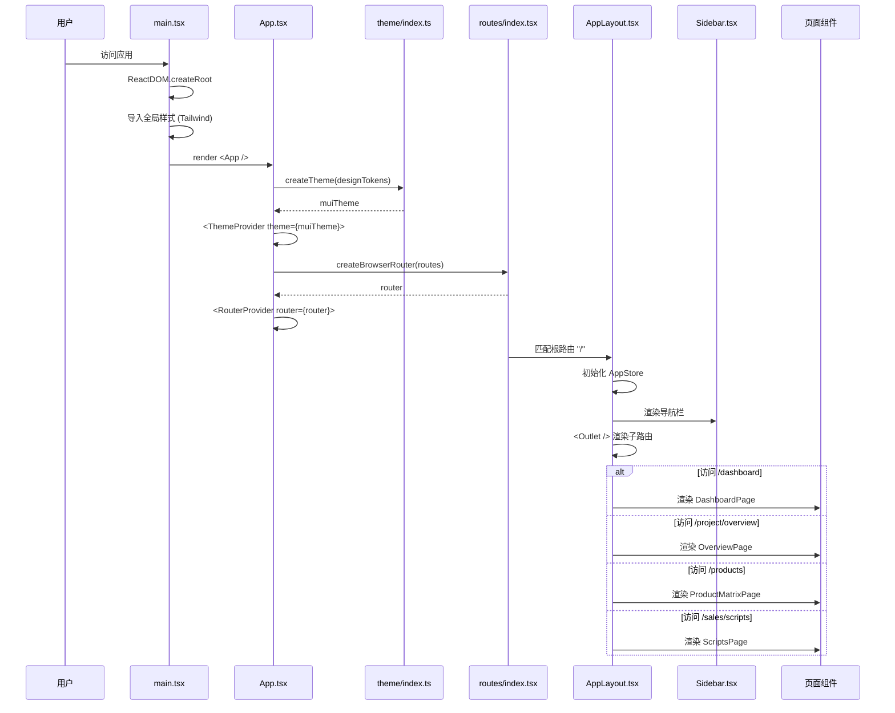
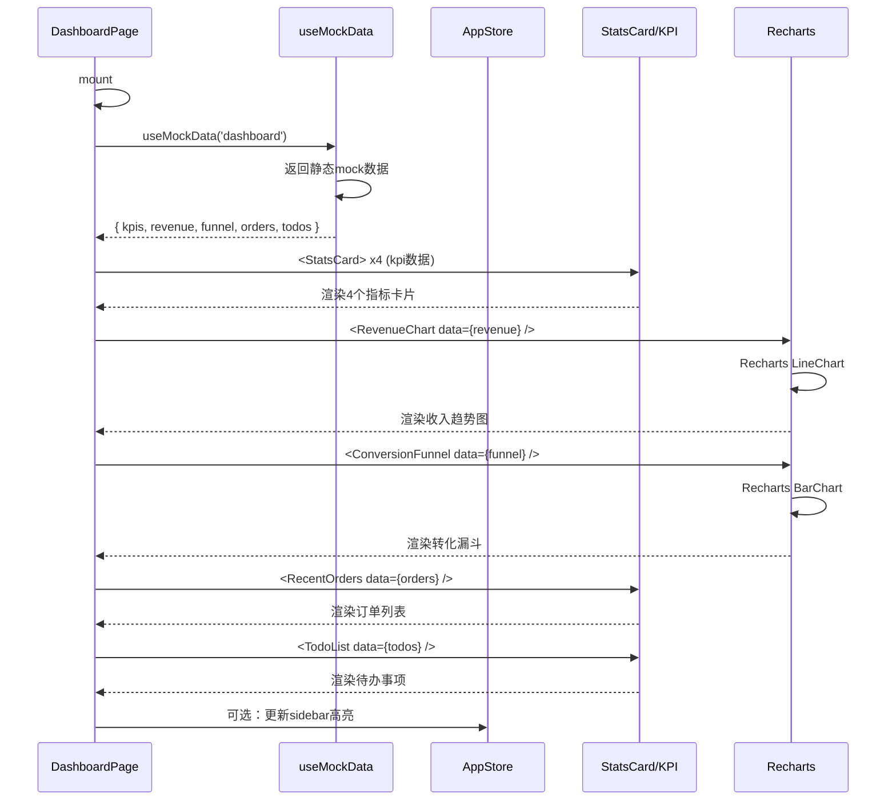
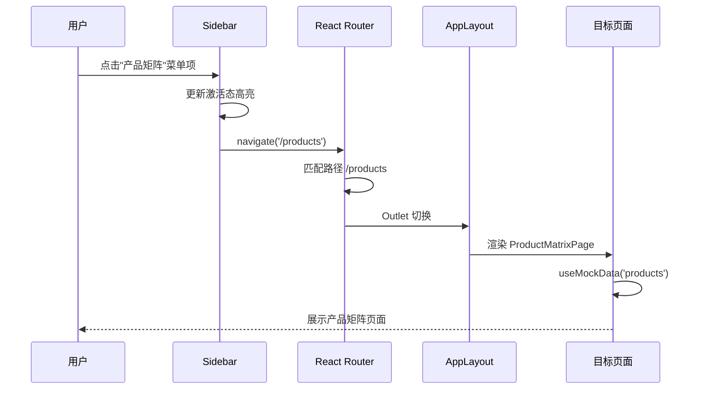
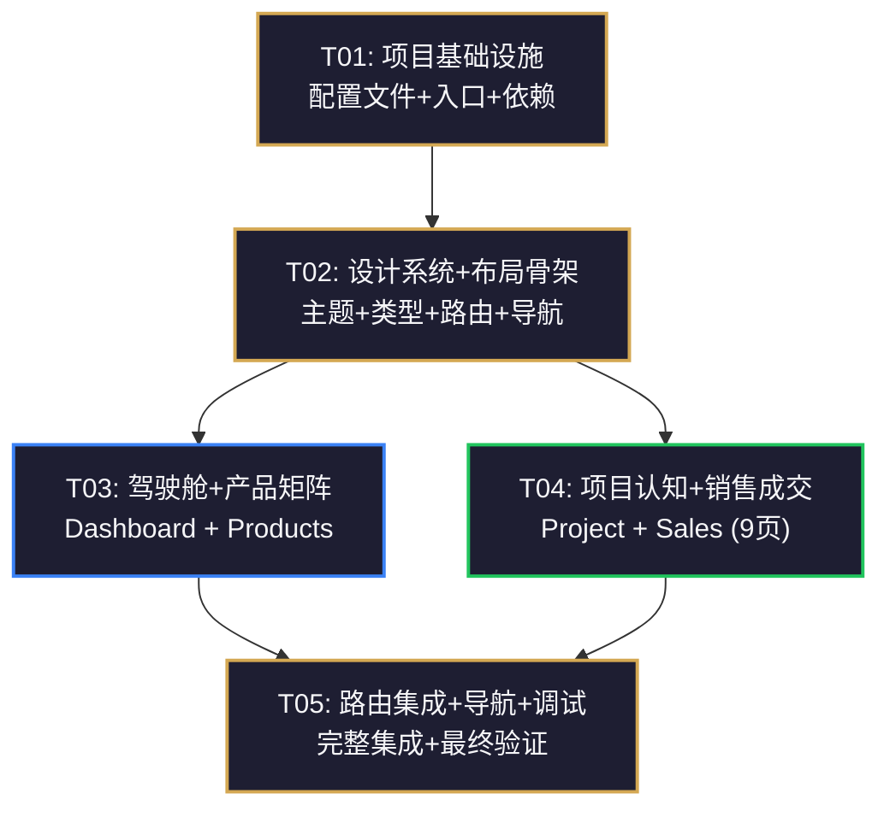

# 极享AI内部管理系统 — 系统设计与任务分解

> **版本**: v1.0 | **阶段**: Phase 1-A（骨架+4模块） | **交付**: 应用骨架 + 数据驾驶舱 + 产品矩阵中心 + 项目认知中心 + 销售成交中心
> **技术栈**: Vite + React 18 + TypeScript + MUI 6 + Tailwind CSS 3 + Zustand + React Router 6

---

## Part A: System Design

---

### 1. Implementation Approach

#### 1.1 核心难点分析

| 难点 | 对应策略 |
|------|---------|
| **深色主题一致性** — 55个原型中的CSS tokens需统一切换到MUI主题系统 | 提取全部CSS变量到MUI `createTheme`，使用`ThemeProvider`全局注入，Tailwind CSS通过`tailwind.config.ts`同步引用同一套色值 |
| **侧栏导航的模块化** — 12大模块动态展示、Phase 1/Phase 2拆分、当前激活态高亮 | 路由配置驱动导航菜单渲染，`useLocation`自动高亮，Phase 2模块用`disabled`或分隔线灰显 |
| **产品等级色体系** — 蓝/绿/紫/金四个等级色在卡片、表格、Tag中统一使用 | 定义为全局枚举 `ProductTier` + 色彩映射函数，组件通过prop自动选择对应颜色 |
| **CMS内容管理** — 项目认知/销售成交大量富文本内容 | 用 `dangerouslySetInnerHTML` 渲染原型中的HTML内容结构，后续可接入富文本编辑器 |
| **布局复用** — 所有页面共享Sidebar+Topbar布局 | 使用 `<Outlet />` 嵌套路由，单一 `AppLayout` 包裹所有页面 |

#### 1.2 框架选型确认

| 技术 | 版本 | 用途 | 选型理由 |
|------|------|------|---------|
| Vite | ^6.x | 构建工具 | 极速HMR，原生ESM，TypeScript原生支持 |
| React | ^18.3 | UI框架 | 组件化，生态成熟 |
| TypeScript | ^5.x | 类型系统 | 大型项目类型安全 |
| MUI 6 | ^6.x | UI组件库 | 企业级组件（DataGrid、Menu、Dialog），`sx` prop适合设计令牌驱动 |
| MUI X | ^7.x | 数据表格 | `DataGridPremium`支持树形数据/聚合/导出，适合产品矩阵和排名 |
| Tailwind CSS 3 | ^3.4 | 实用类样式 | 快速布局/间距/排版，与MUI互补 |
| Zustand | ^5.x | 状态管理 | 极简API，无boilerplate |
| React Router 6 | ^6.x | 路由 | 嵌套路由+Outlet布局模式 |
| Recharts | ^2.x | 图表 | 轻量可组合，适合仪表盘 |
| dayjs | ^1.x | 日期处理 | 轻量替代moment.js |
| @dnd-kit | ^6.x | 拖拽 | 排序/拖拽交互，适合素材排序 |

#### 1.3 架构模式

采用 **Layout → Routes → Pages → Components** 分层架构：

```
ThemeProvider (MUI 主题)
  └── BrowserRouter
       └── AppLayout (Sidebar + Topbar + <Outlet/>)
            ├── /dashboard        → DashboardPage
            ├── /project/*        → ProjectModule (4 pages)
            ├── /products/*       → ProductsModule (1 page, 4 tabs)
            └── /sales/*          → SalesModule (5 pages)
```

- **数据流**: 页面组件 → Zustand store (全局) / 本地state → 纯展示组件
- **样式策略**: MUI `sx` prop 用于组件级主题感知样式，Tailwind utility 用于间距/flex/grid 布局，CSS modules 用于复杂第三方覆盖

---

### 2. File List

项目根目录 `D:\WORKBUDDY项目\中台控制中心\jixiang-admin\`

```
jixiang-admin/
├── index.html                          # 入口 HTML
├── package.json                        # 依赖声明
├── vite.config.ts                      # Vite 配置（含路径别名）
├── tsconfig.json                       # TypeScript 配置
├── tsconfig.node.json                  # Node 环境 TS 配置
├── tailwind.config.ts                  # Tailwind CSS 主题扩展
├── postcss.config.js                   # PostCSS 配置
├── .eslintrc.cjs                       # ESLint 配置
│
├── public/
│   └── favicon.svg                     # 品牌图标
│
└── src/
    ├── main.tsx                        # 应用入口（ReactDOM.createRoot）
    ├── App.tsx                         # 根组件（ThemeProvider + RouterProvider）
    ├── vite-env.d.ts                   # Vite 类型声明
    │
    ├── theme/
    │   ├── index.ts                    # MUI theme 创建（createTheme + 深色定制）
    │   └── tokens.ts                   # 设计令牌常量（色值/间距/圆角/字体等）
    │
    ├── types/
    │   └── index.ts                    # 全局类型定义（数据模型 + 枚举 + 接口）
    │
    ├── layouts/
    │   ├── AppLayout.tsx               # 主布局（Sidebar + Topbar + Outlet）
    │   ├── Sidebar.tsx                 # 左侧导航栏
    │   └── Topbar.tsx                  # 顶部操作栏
    │
    ├── routes/
    │   ├── index.tsx                   # 路由配置表（createBrowserRouter）
    │   └── navItems.ts                 # 导航菜单数据（标题/图标/路径/phase标识）
    │
    ├── stores/
    │   └── appStore.ts                 # 全局应用状态（sidebar折叠/当前用户/主题）
    │
    ├── components/
    │   ├── ui/
    │   │   ├── StatsCard.tsx           # 指标卡片（驾驶舱用）
    │   │   ├── SectionHeader.tsx       # 区域标题组件（含操作按钮）
    │   │   ├── TierTag.tsx             # 产品等级色标签
    │   │   ├── SearchInput.tsx         # 通用搜索输入框
    │   │   ├── FilterChips.tsx         # 筛选标签组（胶囊样式）
    │   │   ├── ContentCard.tsx         # 通用内容卡片
    │   │   └── StatusBadge.tsx         # 状态徽标（成功/警告/危险/信息）
    │   └── layout/
    │       ├── NavSection.tsx          # 导航分组标题
    │       └── NavItem.tsx             # 导航单项（含active高亮）
    │
    ├── pages/
    │   ├── dashboard/
    │   │   ├── DashboardPage.tsx       # 数据驾驶舱主页
    │   │   └── components/
    │   │       ├── KPIRow.tsx          # KPI指标行（4个核心指标）
    │   │       ├── RevenueChart.tsx    # 收入趋势图（Recharts）
    │   │       ├── ConversionFunnel.tsx# 转化漏斗图
    │   │       ├── RecentOrders.tsx    # 最近订单列表
    │   │       └── TodoList.tsx        # 今日待办列表
    │   │
    │   ├── products/
    │   │   ├── ProductMatrixPage.tsx   # 产品矩阵中心（含4个Tab视图）
    │   │   └── components/
    │   │       ├── ProductList.tsx     # 产品列表视图
    │   │       ├── BenefitComparison.tsx # 权益对比表
    │   │       ├── ProductDemo.tsx     # 产品演示标签
    │   │       └── DeliveryChecklist.tsx # 交付清单视图
    │   │
    │   ├── project/
    │   │   ├── index.tsx               # 项目认知路由出口
    │   │   ├── OverviewPage.tsx        # 项目总览
    │   │   ├── FAQPage.tsx             # FAQ管理
    │   │   ├── CompetitivePage.tsx     # 竞品对比
    │   │   ├── GuidePage.tsx           # 新人启动指南
    │   │   └── components/
    │   │       ├── FAQList.tsx         # FAQ手风琴列表
    │   │       └── ComparisonTable.tsx # 竞品对比表格
    │   │
    │   └── sales/
    │       ├── index.tsx               # 销售成交路由出口
    │       ├── ScriptsPage.tsx         # 话术库
    │       ├── QAPage.tsx              # 百问百答
    │       ├── DiagnosisPage.tsx       # 客户诊断
    │       ├── QuotationsPage.tsx      # 报价方案
    │       ├── SOPPage.tsx             # 升单SOP
    │       └── components/
    │           ├── ScriptCard.tsx      # 话术卡片
    │           ├── QAList.tsx          # 问答列表
    │           ├── DiagnosisForm.tsx   # 诊断表单
    │           └── SOPTimeline.tsx     # SOP步骤时间线
    │
    ├── services/
    │   └── api.ts                      # API请求封装（基地址/拦截器/mock数据）
    │
    ├── hooks/
    │   ├── useNavigation.ts            # 导航相关hook（当前模块/面包屑）
    │   └── useMockData.ts              # Mock数据hook（Phase 1-A用静态数据）
    │
    └── utils/
        ├── colors.ts                   # 等级色/语义色工具函数
        ├── formatters.ts               # 金额/日期/数字格式化
        └── constants.ts                # 全局常量（模块名称/路由前缀等）
```

**总计文件数: 56 个**（含配置文件和页面组件）

---

### 3. Data Structures and Interfaces

```mermaid
classDiagram
    %% =========== ENUMS ===========
    class ProductTier {
        <<enumeration>>
        STANDARD = "standard"
        AGENT = "agent"
        OEM = "oem"
        PARTNER = "partner"
    }

    class ContentStatus {
        <<enumeration>>
        DRAFT = "draft"
        PUBLISHED = "published"
    }

    class ScriptCategory {
        <<enumeration>>
        LIVE = "live"
        CHAT = "chat"
        PHONE = "phone"
        MOMENTS = "moments"
        OFFLINE = "offline"
    }

    %% =========== DATA MODELS ===========
    class Product {
        +string id
        +string name
        +number price
        +ProductTier tier
        +string description
        +string[] benefits
        +string[] deliveryItems
        +ContentStatus status
        +string createdAt
        +string updatedAt
        +getTierColor() string
    }

    class ContentBlock {
        +string id
        +string module
        +string category
        +string title
        +string content
        +string coverImage
        +ContentStatus status
        +number sortOrder
        +string createdAt
        +string updatedAt
    }

    class FaqItem {
        +string id
        +string question
        +string answer
        +string category
        +number sortOrder
        +ContentStatus status
        +string[] tags
        +string createdAt
        +string updatedAt
    }

    class Competitor {
        +string id
        +string name
        +string logo
        +string description
        +CompetitorFeature[] features
        +ContentStatus status
        +string createdAt
        +string updatedAt
    }

    class CompetitorFeature {
        +string category
        +string ourValue
        +string competitorValue
        +boolean isAdvantage
    }

    class GuideStep {
        +string id
        +string title
        +string description
        +number stepOrder
        +string icon
        +string[] actionItems
        +ContentStatus status
    }

    class Script {
        +string id
        +string title
        +ScriptCategory category
        +string content
        +string[] tags
        +number viewCount
        +ContentStatus status
        +string createdAt
        +string updatedAt
    }

    class SalesQA {
        +string id
        +string question
        +string answer
        +string scenario
        +string[] keywords
        +ContentStatus status
        +number helpfulCount
        +string createdAt
    }

    class DiagnosisTemplate {
        +string id
        +string title
        +string[] questions
        +DiagnosisQuestion[] questions
        +ContentStatus status
        +string createdAt
    }

    class DiagnosisQuestion {
        +string id
        +string label
        +string type
        +string[] options
        +boolean required
    }

    class Quotation {
        +string id
        +string title
        +ProductTier targetTier
        +string description
        +QuotationItem[] items
        +number totalAmount
        +ContentStatus status
        +string createdAt
    }

    class QuotationItem {
        +string name
        +string description
        +number amount
        +string unit
    }

    class SOP {
        +string id
        +string title
        +string targetStage
        +SOPStep[] steps
        +ContentStatus status
        +string createdAt
        +string updatedAt
    }

    class SOPStep {
        +number stepOrder
        +string title
        +string description
        +string duration
        +string[] resources
        +string[] checkItems
    }

    %% Dashboard models
    class KPIItem {
        +string label
        +number value
        +number change
        +string trend
        +string icon
        +string color
    }

    class OrderRecord {
        +string id
        +string customerName
        +string productName
        +number amount
        +string status
        +string agentName
        +string createdAt
    }

    class TodoItem {
        +string id
        +string title
        +string priority
        +string deadline
        +boolean completed
        +string module
    }

    %% =========== STORE ===========
    class AppStore {
        +boolean sidebarCollapsed
        +string currentUser
        +string currentRole
        +toggleSidebar() void
        +setUser(user) void
    }

    %% =========== SERVICE ===========
    class ApiService {
        +baseURL string
        +get(endpoint) Promise
        +post(endpoint, data) Promise
        +put(endpoint, data) Promise
        +delete(endpoint) Promise
    }

    %% =========== RELATIONSHIPS ===========
    Product "1" --> "1" ProductTier : tier
    ContentBlock "1" --> "1" ContentStatus : status
    FaqItem "1" --> "1" ContentStatus : status
    Script "1" --> "1" ScriptCategory : category
    Script "1" --> "1" ContentStatus : status
    SalesQA "1" --> "1" ContentStatus : status

    Competitor "1" --> "*" CompetitorFeature : features
    DiagnosisTemplate "1" --> "*" DiagnosisQuestion : questions
    Quotation "1" --> "*" QuotationItem : items
    SOP "1" --> "*" SOPStep : steps

    DashboardPage "1" --> "*" KPIItem : renders
    DashboardPage "1" --> "*" OrderRecord : renders
    DashboardPage "1" --> "*" TodoItem : renders
```



---

### 4. Program Call Flow

#### 4.1 应用初始化流程



#### 4.2 页面加载 & Mock数据流程 (以驾驶舱为例)



#### 4.3 导航切换 & 页面路由



---

### 5. Anything UNCLEAR

| 问题 | 假设方案 |
|------|---------|
| **API 接口尚未定义** | Phase 1-A 全部使用 `useMockData` hook 返回静态 mock 数据，数据结构与类型定义完全对齐，后续替换为真实 API 时只需修改 service 层 |
| **用户认证/登录页面** | Phase 1-A 暂不实现登录页，当前假设用户已登录，AppStore 中硬编码为"超级管理员"角色。后续 Phase 1-B 加入 `/login` |
| **富文本编辑器** | 原型中的项目总览、FAQ 等页面包含格式化内容。Phase 1-A 直接渲染静态 HTML 内容，不引入编辑器库 |
| **多语言/国际化** | 暂不引入 i18n，全部使用中文硬编码 |
| **数据持久化** | 当前无后端，所有数据为前端 mock。后续对接 REST API 时通过 `services/api.ts` 统一替换 |
| **MUI v6 正式版本** | 若 MUI v6 未正式发布，使用 MUI v5.x（API 兼容）；Package.json 中标注版本为 `^5` 以兼容 |

---

## Part B: Task Decomposition

---

### 6. Required Packages

```json
{
  "dependencies": {
    "react": "^18.3.1",
    "react-dom": "^18.3.1",
    "@mui/material": "^5.16.0",
    "@mui/icons-material": "^5.16.0",
    "@mui/x-data-grid": "^7.0.0",
    "@emotion/react": "^11.11.0",
    "@emotion/styled": "^11.11.0",
    "react-router-dom": "^6.23.0",
    "zustand": "^4.5.0",
    "recharts": "^2.12.0",
    "dayjs": "^1.11.0",
    "@dnd-kit/core": "^6.1.0",
    "@dnd-kit/sortable": "^8.0.0",
    "@dnd-kit/utilities": "^3.2.0"
  },
  "devDependencies": {
    "@vitejs/plugin-react": "^4.3.0",
    "vite": "^5.4.0",
    "typescript": "^5.5.0",
    "@types/react": "^18.3.0",
    "@types/react-dom": "^18.3.0",
    "tailwindcss": "^3.4.0",
    "postcss": "^8.4.0",
    "autoprefixer": "^10.4.0",
    "eslint": "^8.57.0",
    "@typescript-eslint/eslint-plugin": "^7.0.0",
    "@typescript-eslint/parser": "^7.0.0",
    "eslint-plugin-react-hooks": "^4.6.0"
  }
}
```

---

### 7. Task List (ordered by dependency)

#### T01: 项目基础设施 — 脚手架 + 配置 + 入口

| 字段 | 值 |
|------|-----|
| **Task ID** | T01 |
| **Task Name** | 项目基础设施搭建（配置文件 + 入口文件 + 依赖声明） |
| **Priority** | P0 |
| **Dependencies** | 无 |
| **Source Files** | `package.json`, `vite.config.ts`, `tsconfig.json`, `tsconfig.node.json`, `tailwind.config.ts`, `postcss.config.js`, `.eslintrc.cjs`, `index.html`, `public/favicon.svg`, `src/main.tsx`, `src/App.tsx`, `src/vite-env.d.ts` |

**描述**:
1. 初始化 `package.json`（所有依赖声明，见第6节）
2. 配置 `vite.config.ts`：React 插件、路径别名 `@/` → `src/`
3. 配置 `tsconfig.json`：strict 模式、路径映射 `@/*`
4. 配置 `tailwind.config.ts`：扩展主题色（深色背景/金色/文字色/语义色/等级色），内容路径扫描
5. 配置 `postcss.config.js`：Tailwind + autoprefixer
6. 创建 `index.html`：引入 Inter 字体 + JetBrains Mono 字体（Google Fonts CDN）
7. 创建 `src/main.tsx`：`ReactDOM.createRoot` 入口，导入全局CSS
8. 创建 `src/App.tsx`：空壳（`<div>App</div>`），后续迭代注入

**验收标准**:
- `npm run dev` 启动成功，浏览器显示 "App" 文字
- 字体正常加载（Inter 和 JetBrains Mono）
- Tailwind utility class 生效（验证 `text-gold` 等自定义色值）

---

#### T02: 设计系统 + 布局骨架 + 数据层

| 字段 | 值 |
|------|-----|
| **Task ID** | T02 |
| **Task Name** | 设计系统令牌 + MUI 主题 + 布局骨架 + 类型定义 + 状态管理 + 路由配置 |
| **Priority** | P0 |
| **Dependencies** | T01 |
| **Source Files** | `src/theme/tokens.ts`, `src/theme/index.ts`, `src/types/index.ts`, `src/stores/appStore.ts`, `src/routes/navItems.ts`, `src/routes/index.tsx`, `src/layouts/AppLayout.tsx`, `src/layouts/Sidebar.tsx`, `src/layouts/Topbar.tsx`, `src/components/layout/NavSection.tsx`, `src/components/layout/NavItem.tsx`, `src/utils/colors.ts`, `src/utils/formatters.ts`, `src/utils/constants.ts`, `src/services/api.ts`, `src/hooks/useNavigation.ts`, `src/hooks/useMockData.ts` |

**描述**:
1. **设计令牌** (`src/theme/tokens.ts`)：提取原型中所有 CSS 变量为 TS 常量对象（色值/间距/圆角/字体/阴影）
2. **MUI 主题** (`src/theme/index.ts`)：`createTheme` 深色主题，`palette` 映射设计令牌，`typography` 字体族，`shape` 圆角体系，`components` 全局覆盖（Card/Button/Tag 等）
3. **类型定义** (`src/types/index.ts`)：所有数据模型接口 + 枚举（Product, ContentBlock, FaqItem, Competitor, Script, SalesQA, DiagnosisTemplate, Quotation, SOP 等）
4. **全局状态** (`src/stores/appStore.ts`)：Zustand store（sidebarCollapsed, currentUser, role）
5. **路由配置** (`src/routes/`)：`navItems.ts` 菜单数据结构（按模块分组含phase标识），`index.tsx` createBrowserRouter 含根布局
6. **布局骨架** (`src/layouts/`)：`AppLayout.tsx` 侧栏+顶栏+Outlet，`Sidebar.tsx` 导航菜单渲染（含Phase 2灰显分隔），`Topbar.tsx` 标题+日期+操作按钮
7. **导航组件**：`NavSection.tsx` 分组标题，`NavItem.tsx` 菜单项（active高亮金色3px左竖条）
8. **工具函数**：`colors.ts` 等级色映射，`formatters.ts` 金额/日期格式化，`constants.ts` 模块常量
9. **Service层**：`api.ts` 请求封装，`useMockData.ts` mock数据hook，`useNavigation.ts` 导航辅助

**验收标准**:
- 浏览器显示完整布局：左侧深色导航栏 + 顶部金色标题栏 + 右侧内容区
- 导航菜单展示Phase 1-A四个模块，Phase 2模块灰显
- 点击菜单项URL变化但页面404（待T03/T04实现）
- 设计令牌生效（深色背景#0F0F1A，卡片#1E1E32，金色#D4A853）
- Sidebar 可折叠展开

---

#### T03: 数据驾驶舱 + 产品矩阵中心

| 字段 | 值 |
|------|-----|
| **Task ID** | T03 |
| **Task Name** | 数据驾驶舱（Dashboard） + 产品矩阵中心（Product Matrix） |
| **Priority** | P0 |
| **Dependencies** | T02 |
| **Source Files** | `src/components/ui/StatsCard.tsx`, `src/components/ui/SectionHeader.tsx`, `src/components/ui/TierTag.tsx`, `src/components/ui/SearchInput.tsx`, `src/components/ui/FilterChips.tsx`, `src/components/ui/ContentCard.tsx`, `src/components/ui/StatusBadge.tsx`, `src/pages/dashboard/DashboardPage.tsx`, `src/pages/dashboard/components/KPIRow.tsx`, `src/pages/dashboard/components/RevenueChart.tsx`, `src/pages/dashboard/components/ConversionFunnel.tsx`, `src/pages/dashboard/components/RecentOrders.tsx`, `src/pages/dashboard/components/TodoList.tsx`, `src/pages/products/ProductMatrixPage.tsx`, `src/pages/products/components/ProductList.tsx`, `src/pages/products/components/BenefitComparison.tsx`, `src/pages/products/components/ProductDemo.tsx`, `src/pages/products/components/DeliveryChecklist.tsx` |

**描述**:

**共享 UI 组件库**（优先实现，供所有页面复用）:
- `StatsCard`：指标卡片（背景+icon+数值+变化率），原型 dashboard 风格
- `SectionHeader`：区域标题（左标题+右操作按钮）
- `TierTag`：产品等级色标签（蓝/绿/紫/金映射）
- `SearchInput`：搜索输入框（放大镜icon+金色focus）
- `FilterChips`：胶囊式筛选标签组
- `ContentCard`：通用内容卡片（背景+圆角12px+边框）
- `StatusBadge`：状态徽标（草稿/已发布/成功/警告/危险）

**数据驾驶舱** (`/dashboard`):
- 顶部KPI行：4个核心指标（店播成交人数/加微率/有效诊断率/高客单升单率）使用 `StatsCard`
- 收入趋势图：`RevenueChart` 使用 Recharts `LineChart`/`AreaChart`
- 转化漏斗：`ConversionFunnel` 使用 Recharts `BarChart`（横向条形图模拟漏斗）
- 最近订单：`RecentOrders` 使用 MUI `Table` 展示最近5条订单
- 今日待办：`TodoList` 带优先级标识的待办列表
- 使用 `useMockData` 提供静态数据

**产品矩阵中心** (`/products`):
- Tab切换视图（MUI `Tabs`）：产品列表 / 权益对比 / 产品演示 / 交付清单
- 产品列表：`ProductList` 卡片网格展示所有产品（含等级色Tag/价格/描述）
- 权益对比：`BenefitComparison` 表格对比各等级权益（列头按等级色渲染）
- 产品演示：`ProductDemo` 占位内容
- 交付清单：`DeliveryChecklist` 按等级展示交付物

**验收标准**:
- 访问 `/dashboard` 完整渲染驾驶舱页面
- 4个KPI卡片展示mock数据，变化率红色绿色箭头
- Recharts 图表正确渲染
- 产品矩阵Tab切换正常工作
- 等级色标签正确显示蓝/绿/紫/金色

---

#### T04: 项目认知中心 + 销售成交中心

| 字段 | 值 |
|------|-----|
| **Task ID** | T04 |
| **Task Name** | 项目认知中心（4页） + 销售成交中心（5页） |
| **Priority** | P0 |
| **Dependencies** | T02, T03 |
| **Source Files** | `src/pages/project/index.tsx`, `src/pages/project/OverviewPage.tsx`, `src/pages/project/FAQPage.tsx`, `src/pages/project/CompetitivePage.tsx`, `src/pages/project/GuidePage.tsx`, `src/pages/project/components/FAQList.tsx`, `src/pages/project/components/ComparisonTable.tsx`, `src/pages/sales/index.tsx`, `src/pages/sales/ScriptsPage.tsx`, `src/pages/sales/QAPage.tsx`, `src/pages/sales/DiagnosisPage.tsx`, `src/pages/sales/QuotationsPage.tsx`, `src/pages/sales/SOPPage.tsx`, `src/pages/sales/components/ScriptCard.tsx`, `src/pages/sales/components/QAList.tsx`, `src/pages/sales/components/DiagnosisForm.tsx`, `src/pages/sales/components/SOPTimeline.tsx` |

**描述**:

**项目认知中心** (`/project/*`):
- `index.tsx`：子路由出口 Outlet
- 项目总览 (`/project/overview`)：品牌介绍/IP故事等内容块，使用 `ContentCard` 排版
- FAQ管理 (`/project/faq`)：手风琴式FAQ列表，`FAQList` 组件实现展开/折叠
- 竞品对比 (`/project/competitive`)：`ComparisonTable` 对比表（我方 vs 竞品优劣）
- 新人指南 (`/project/guide`)：分步骤启动指南，步骤时间线布局

**销售成交中心** (`/sales/*`):
- `index.tsx`：子路由出口 Outlet
- 话术库 (`/sales/scripts`)：`ScriptCard` 网格展示+ `FilterChips` 按场景筛选+搜索
- 百问百答 (`/sales/qa`)：`QAList` 搜索+分类+问答展开
- 客户诊断 (`/sales/diagnosis`)：`DiagnosisForm` 诊断表单（模拟填写界面）
- 报价方案 (`/sales/quotations`)：报价方案列表 + 详情展开
- 升单SOP (`/sales/sop`)：`SOPTimeline` 分步骤流程时间线

**验收标准**:
- 项目认知4个页面均可通过侧栏导航访问
- FAQ 展开/折叠交互正常
- 话术库搜索和分类筛选正常工作
- 所有页面均使用T02的布局骨架和T03的共享UI组件
- 页面风格与原型一致（深色主题/卡片/圆角/金色点缀）

---

#### T05: 路由集成 + 导航完善 + 最终调试

| 字段 | 值 |
|------|-----|
| **Task ID** | T05 |
| **Task Name** | 路由完整集成 + 导航激活态 + 全局样式微调 + 最终验证 |
| **Priority** | P0 |
| **Dependencies** | T03, T04 |
| **Source Files** | `src/App.tsx`, `src/routes/index.tsx`, `src/routes/navItems.ts`, `src/layouts/Sidebar.tsx`, `src/layouts/Topbar.tsx`, `src/stores/appStore.ts`, `src/hooks/useNavigation.ts` |

**描述**:
1. **路由集成**：在 `App.tsx` 中激活完整 `RouterProvider`，所有Phase 1-A页面注册完毕
2. **导航激活态**：`Sidebar` 根据 `useLocation().pathname` 自动高亮当前模块（金色3px左竖条 + 金色文字）
3. **面包屑/标题联动**：`Topbar` 根据当前路由显示对应模块标题
4. **全局样式微调**：滚动条样式统一（6px宽暗色）、过渡动画、hover态一致性检查
5. **Phase 2 分隔**：导航菜单中 Phase 2 模块分组显示，添加视觉分隔线
6. **响应式基础**：Sidebar 在小屏自动折叠，内容区自适应
7. **最终验证检查清单**:
   - [ ] `npm run dev` 无报错
   - [ ] 所有11个页面路由可访问
   - [ ] 侧栏导航高亮正确
   - [ ] 所有页面渲染无崩溃
   - [ ] 设计令牌一致性（背景色/卡片色/文字色/金色）
   - [ ] 等级色标签正确映射
   - [ ] 无控制台报错

**验收标准**:
- 完整Phase 1-A 4个模块11个页面全链路可访问
- 导航高亮随路由变化准确
- 顶部栏标题随页面变化
- 无TypeScript编译错误
- 与HTML原型视觉一致

---

### 8. Shared Knowledge

#### 8.1 命名规范

| 类别 | 规范 | 示例 |
|------|------|------|
| **组件文件** | PascalCase，`.tsx` 后缀 | `StatsCard.tsx`, `ProductMatrixPage.tsx` |
| **工具/配置** | camelCase，`.ts` 后缀 | `formatters.ts`, `useMockData.ts` |
| **类型/接口** | PascalCase，`interface` 优先 | `interface Product`, `interface FaqItem` |
| **枚举** | PascalCase，值 kebab-case | `enum ProductTier { STANDARD = 'standard' }` |
| **React组件函数** | 默认导出 + 同名函数名 | `export default function StatsCard() {}` |
| **工具函数** | 具名导出 | `export function formatCurrency() {}` |
| **状态store** | camelCase，use 前缀 | `useAppStore`, `useNavigation` |
| **CSS类名** | Tailwind utility class 优先 | 避免自定义类名 |
| **文件夹** | kebab-case | `dashboard/`, `sales/components/` |

#### 8.2 组件编写约定

```
1. 每个组件文件不超过 500 行
2. 组件职责单一：一个组件只做一件事
3. 页面组件放在 pages/{module}/ 下
4. 共享UI组件放在 components/ui/ 下
5. 布局组件放在 layouts/ 下
6. 所有组件使用 TypeScript 严格类型
7. Props 接口定义在组件文件顶部
8. 复杂组件拆分为子目录 components/{parent-component}/
```

#### 8.3 样式策略

| 场景 | 方案 | 原因 |
|------|------|------|
| **组件级主题色** | MUI `sx` prop | 直接访问 `theme.palette` 设计令牌 |
| **布局/间距/Flex** | Tailwind utility | 简洁快速，`flex`, `gap-4`, `p-6` |
| **Typography** | MUI `Typography` 组件 | 统一字体层级 |
| **卡片/按钮等MUI组件** | MUI组件 + `sx` 覆盖 | 保持MUI一致性 |
| **复杂覆盖** | CSS modules（不常用） | 极少数第三方覆盖场景 |
| **条件样式** | `clsx` 或模板字符串 | 动态类名组合 |

**不建议**: 同时使用 MUI `sx` 和 Tailwind 在同一个元素上。选择一种方式并保持一致。
**推荐**: MUI组件用 `sx`，布局容器用 Tailwind `className`。

#### 8.4 导入路径别名

`vite.config.ts` 中配置 `@/` 映射到 `src/`：

```typescript
// vite.config.ts
resolve: {
  alias: {
    '@': path.resolve(__dirname, 'src'),
  },
}
```

使用时：
```typescript
// 推荐
import { Product } from '@/types'
import { StatsCard } from '@/components/ui/StatsCard'
import DashboardPage from '@/pages/dashboard/DashboardPage'

// 不推荐
import { Product } from '../../types'
```

#### 8.5 设计令牌引用规范

所有原型中的 CSS 变量已提取到 `src/theme/tokens.ts`，MUI 主题自动注入。在组件中通过以下方式引用：

```typescript
// MUI sx 方式（推荐用于MUI组件）
<Box sx={{ bgcolor: 'background.default', color: 'text.primary' }} />

// 直接引用 tokens（用于 Tailwind）
<div className="bg-card-bg text-text-primary" />

// tailwind.config.ts 中已配置色值扩展
// 可用: bg-bg-primary, text-gold, border-border, bg-surface 等
```

可用的 Tailwind 自定义色值（已在 tailwind.config.ts 配置）：
| Class | 值 |
|-------|-----|
| `bg-bg-primary` | `#0F0F1A` |
| `bg-surface` | `#1E1E32` |
| `text-gold` | `#D4A853` |
| `text-primary` | `#F5F5F7` |
| `text-secondary` | `#A0A0B8` |
| `text-tertiary` | `#6B6B82` |
| `border-border` | `#2E2E44` |
| `border-border-strong` | `#3D3D58` |
| `text-success` | `#22C55E` |
| `text-warning` | `#F59E0B` |
| `text-danger` | `#EF4444` |
| `text-info` | `#3B82F6` |
| `tier-blue` | `#3B82F6` |
| `tier-green` | `#22C55E` |
| `tier-purple` | `#A855F7` |
| `tier-gold` | `#F59E0B` |

#### 8.6 产品等级色映射函数

```typescript
// src/utils/colors.ts
export const TIER_COLORS: Record<ProductTier, string> = {
  [ProductTier.STANDARD]: '#3B82F6',   // 蓝
  [ProductTier.AGENT]: '#22C55E',      // 绿
  [ProductTier.OEM]: '#A855F7',        // 紫
  [ProductTier.PARTNER]: '#F59E0B',    // 金
}

export function getTierColor(tier: ProductTier, alpha?: number): string {
  const color = TIER_COLORS[tier]
  return alpha ? `${color}${Math.round(alpha * 255).toString(16).padStart(2, '0')}` : color
}
```

#### 8.7 Mock 数据管理

- 所有 Phase 1-A 数据存放在 `useMockData` hook 中
- 按模块分组返回数据对象
- 数据结构与 `@/types` 中定义的接口完全一致
- 后续替换为真实 API 时，只需修改 `services/api.ts` 和 `useMockData` 的引用

```typescript
// useMockData 返回值结构
{
  dashboard: { kpis, revenue, funnel, orders, todos },
  products: { products, comparisons },
  project: { overview, faqs, competitors, guides },
  sales: { scripts, qaList, diagnoses, quotations, sops },
}
```

#### 8.8 路由结构总结

```
/dashboard                    → 数据驾驶舱
/project/overview             → 项目总览
/project/faq                  → FAQ管理
/project/competitive          → 竞品对比
/project/guide                → 新人指南
/products                     → 产品矩阵（含Tabs）
/sales/scripts                → 话术库
/sales/qa                     → 百问百答
/sales/diagnosis              → 客户诊断
/sales/quotations             → 报价方案
/sales/sop                    → 升单SOP
```

---

### 9. Task Dependency Graph



**任务依赖说明**:
- **T01**（基础设施）是唯一无依赖的起点任务
- **T02**（设计系统+布局）依赖 T01，完成后提供主题/路由/布局骨架
- **T03**（驾驶舱+产品矩阵）依赖 T02，使用共享UI组件和布局
- **T04**（项目认知+销售成交）依赖 T02，同样使用共享组件
- **T03 和 T04 可并行开发**（彼此无依赖）
- **T05**（集成）依赖 T03 + T04，所有页面就绪后统一整合

**并行度建议**: 工程师可先完成 T01→T02，然后分两轮并行完成 T03 和 T04，最后 T05 收尾。
